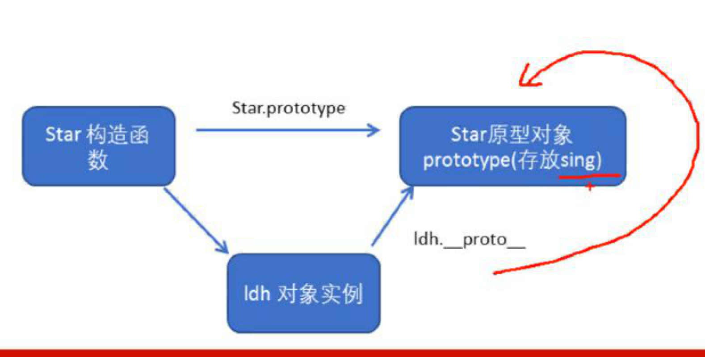
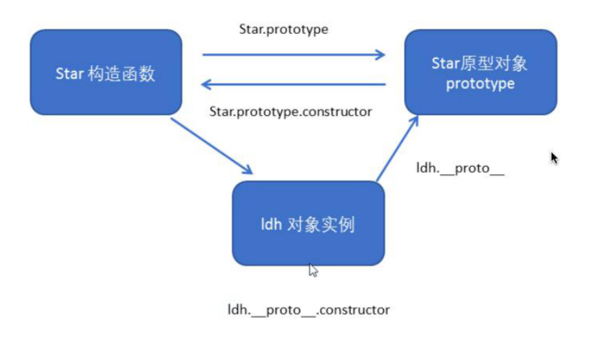
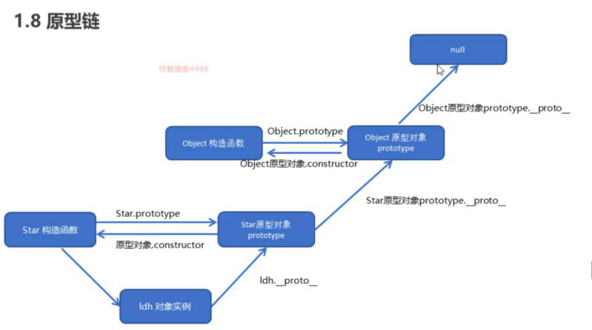
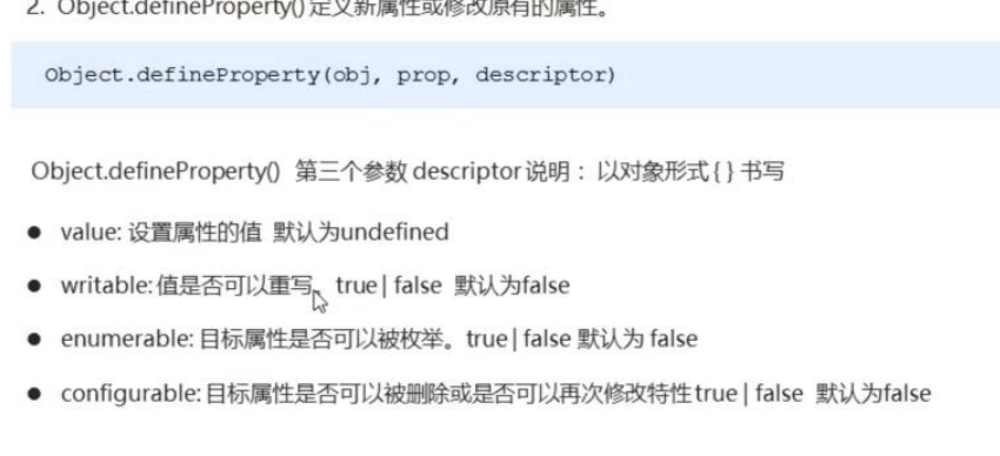

# 构造函数

## new在执行时会做的四件事(面试)

1.在内存中创建一个新的空对象 / 开辟内存空间

2.将构造函数中的this指向这个新的对象 

3.执行构造函数里面的代码，给这个新对象添加属性和方法

4.返回个新对象（不用return)

---

## 实例成员和静态成员

实例成员：通过构造函数用this添加的叫实例成员

静态成员：在外面添加的成员叫静态成员

#### 实例成员只能通过实例化对象来访问

#### 静态成员只能通过构造函数访问

---

## 构造函数原型prototype

### 1.原型就是名为prototype的对象

### 2.原型的作用是共享

一般情况下会把公共属性定义在构造函数中，但公共方法定义在原型对象身上

---

## 对象原型 __proto__

只要是对象系统就会自动添加一个__protot__指向构造函数的原型对象，这个对象和构造函数的prototype的指向是一样的

---

## 方法查找规则

先看对象身上是否有方法，有就执行，否则去构造函数身上查找是否有方法



---

## proto和prototype里都有一个constructor

主要用于记录该对象引用于哪个构造函数

```js
//通过此方式添加
Person.prototype = {
  constructor = Person//需要重新指回
sayHi:function(){
  console.log()
	}
}
```

---

## 构造函数、实例、原型对象三者之间的关系



---

## 原型链



查找规则，一级一级的往上找，并且遵循就近原则

---

## 扩展内置对象的方法

```js
Person.prototype.方法 = function(){
  return 
}
console.log(Person.prototype)
console.log(对象名.方法)
```

---

## call方法

调用这个函数，修改函数运行时this的指向

```js
//调用
函数名.call()

//改this指向
函数名.call(对象名,'实参','实参',···)
```

---

## 继承

使用call来调用父函数，可以继承属性

但是要继承方法要如下

```js
Son.prototype = new Father()
Son.prototyoe = constructor.Son
```

---

## 数组的新方法

### forEach遍历

```js
//不用再for循环就可以或许索引号
var arr = [1,23,4]
arr.forEach(function(value,index,array){
  console.log('每个数组元素' + value)
  console.log('每个数组元素的索引号' + index)
  console.log('数组本身' + array)
})
```

---

### filter()

```js
//用于创建一个新数组，主要用于筛选数组
var arr = [1,23,4]
var newArr = arr.filter(function(value,index,array){
return value >=20
})
#返回的是一个新数组，会把所有的元素返回
```

---

### some()

```js
//查找数组中是否有满足条件的元素
var arr = [10,30,4]
var flag = arr.some(function(value){
  return value >= 20
})
#如果满足条件则不会继续执行，返回的是一个布尔
#return只能终止some方法的循环，而不能终止forEach 和 filter
```

---

## 字符串方法

trim()去除字符串两边的空格

startsWith模糊查询查找符合开头的

endsWith查找符合结尾的

---

## 对象方法

Object.keys()

类似于for...in

```js
//返回的是一个由属性名组成的数组
var obj = {
  id:1,
  pname:'小米',
  price:1999,
  num:2000
}
var arr = Object.keys(obj)
console.log(arr)
#获取属性名的（键）
```

---

## Object.defineProperty()

```js
//定义新属或修改原有的属性
Object.defineProperty(obj,prop,descriptor)
obj:必须，目标对象
prop:必须，需要定义或修改的属性名字（需要加引号）
#descriptor:必须，以对象{}形式书写
```



enumerable为false时无法被遍历出来，默认为false

conifgurable为false时，不会被删除和修改特性，默认为false

特性即为第三个参数里的三种的布尔值

---


