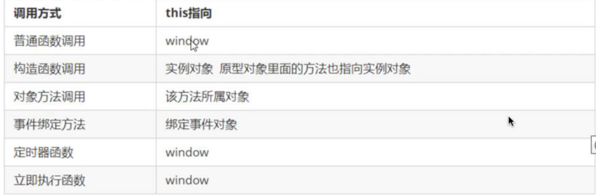

# 函数的定义

1.自定义表达式

function fun(){}

2.匿名函数

var fun = function(){}

3.利用new Function('参数1','参数2','函数体')

```js
var f = new Function('a','b','console.log(a+b)')
f(1,2)
//所有的函数都是Function的实例对象
```

---

## 调用方式

```js
//普通方式
fn()
fn.call()
对象.方法()
//new
function Star(){}
new Star()
```

---

## this指向



谁用指谁

---

## 改变this指向

```js
//bind() call() apply()
fun.call(指向的对象,'实参1','实参2')

//call()的主要作用可以实现继承
function Father(a,b,c){
  this.a = a;
  this.b = b;
  this.c = c;
}
function Son(a,b,c){
  Father.call(this,a,b,c)
}
var son = new Son(1,2,3)
console.log(son)

//apply()调用函数，改变函数内部的this指向，但是参数必须是数组形式的
fn.apply(对象名,[])
#主要作用可以借助数学内置对象求最大值
var arr = [1,23,3,5,7]
var max = Math.max.apply(Math,arr)

//bind()不会调用函数，但是能改变函数内部this的指向，返回的是原函数改变this之后产生的新函数
var f = fun.bind(对象，'参数1','参数2')
#如果有的函数不需要立即调用可以用bind
```

---

## 严格模式

```js
//在最上面写
'use strict'
//开启严格模式
```

---

## 高阶函数

作为参数返回和回调函数就是高阶函数

---

## 闭包

闭包就是一个函数

```js
function fn(){
  num = 10
  function fun(){
    console.log(num)
  }
  fun()
}
fn()
//fun()可以访问fn()的变量，fn()就是一个闭包
```

---

## 闭包的作用

```js
function fn(){
  num = 10
  function fun(){
    console.log(num)
  }
  return fun
}
var f = fn()
f()
//延伸了变量的作用范围
```

````js
//利用闭包的 方式的得到当前小li的索引号
for(var i=0;i<lis.length;i++){
(function(i){//形参 函数内部的变量
  lis[i].onclick = function(){
    console.log(i)//如果改函数被执行 就形成了闭包
  }
})(i)
}
//能别用就别用，内存泄露，w本该本回收的资源没有被回收
````

---

## 定时器中的闭包

