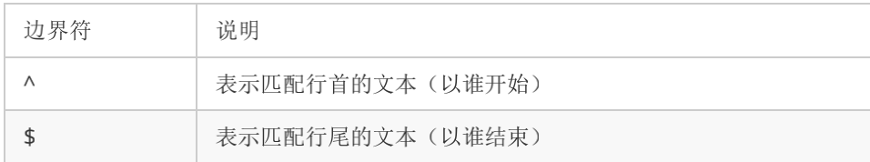
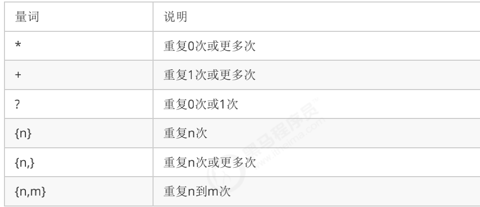
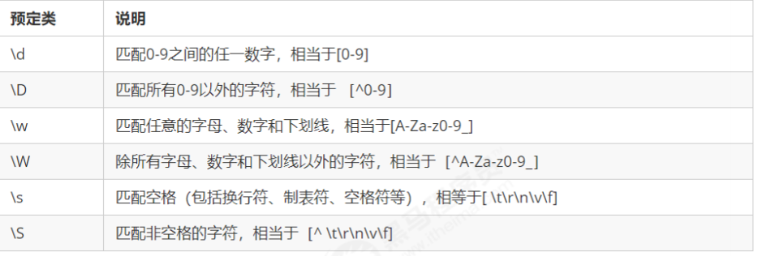

# 递归

函数内部自己调用自己，这个函数就是递归函数

```js
function fn(){
  fn()
}
fn()
#但是要找一个出口不然就成了死循环，很消耗资源
```


---

## 内存的堆和栈

就是内存的两片区域

堆：存储对象，比较大

栈：执行栈，效率高，但空间小，函数会以压栈，弹栈的方式执行

---

## 正则表达式

适用于匹配字符串中字符组合的模式

```js
//标准模式
var regexp = new RegExp(/123/)

//字面量
var rg = /123/

//验证,返回的是个布尔，用来测试文本的
rg.test(123)
```

---



[ ]表示有一系列字符可供选择，只要有一个就可以了

-表示范围

如果边界符^写在中括号里面则表示取反

小括号表示优先级





---

## replace替换

```js
var str = 'andy和red'
var newStr = str.replace('andy','baby')
console.log(newStr)
//可以写被替换的字符串或者正则表达式
var newStr = str.replace(/andy/g,'**')
g全局匹配
i忽略大小写
gi全局匹配加忽略大小写
```

