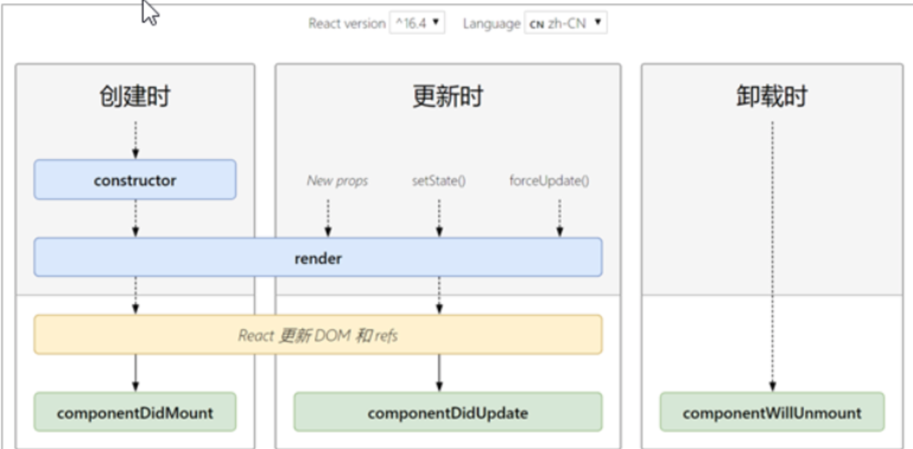

## 生命周期

```jsx
#只有类组件才有生命周期

// 创建时(挂载阶段)
constructor() // 创建组件时，最先执行，用来初始化state,为事件处理程序绑定this
render() // 每次渲染都会触发，用来渲染UI，注意此处不能调用setState()
conponentDidMount() // 组件挂载(完成DOM渲染后)用来进行DOM操作，发送网络请求，获取远程的数据

// 更新时
render() // 接收到新的Props、使用setState()、调用forceUpdate()时触发
componentDidUpdate() // 组件更新完成后（完成DOM渲染）后触发，用来发送请求，DOM操作，注意：如果在此钩子中使用setState()必须在if条件中

// 卸载时
componentWillUnmount() // 组件从页面消失就会触发，用于执行清理工作

#render运行setState()会进行递归渲染发生栈溢出,因为在调用setState()时会自动调用render()
```



```jsx
// 更新时，在componentDidUpdate中使用setState的例子
componentDidUpdate(prevProps) {
  console.log('上一次的props', prevProps)
  if (prevProps.count !== this.props.count) { // 判断上次的props是否和这次的props相同来使用setState()
      this.setState({})
    	// 发送请求也要放在判断中
      }
}
```

---

## render-props模式

```jsx
// 把能够复用的代码（数据和方法）抽离成一个组件

// 1.添加一个值为函数的prop，通过函数参数来获取state
// 子组件（复用的组件和信息在这里
render () {
    return this.props.render(this.state)
  }

// 2.使用该函数的返回值作为要渲染的UI内容
// 父组件
<Mouse render={mouse => {
	return <p>X:{mouse.x}, Y:{mouse.y}</p>
 	}}>
</Mouse>

```

---

## children代替render属性（推荐）

```jsx
// 父组件
<Mouse>
  {mouse => {
    return (
    	<p>
        鼠标位置: {mouse.x}, {mouse.y}
      </p>
    )
  }}
</Mouse>

// 子组件（复用的组件和信息在这里）
render () {
    return this.props.children(this.state)
  }
```

---

## 高阶组件

```jsx
// 高阶组件是一个函数，接收要包装的组件，返回增强后的组件
const EnhancedComponent = withHOC(WrappedComponent)

// 高阶组件内部创建的类组件
class Mouse extends React.Component {
  render () {
    return <WrappedComponent {...this.state} />
  }
}
```

## 使用步骤

```jsx
// 1.创建一个函数，约定名称以with开头
// 2.指定函数参数，参数应该以大写字母开头
function withMouse (WrappedComponent) {
  // 3.在函数内部创建一个类组件，提供复用的状态逻辑代码，并返回
  class Mouse extends React.Component {}
  return Mouse
}

// 4.在该组件中，渲染参数组件，同时将状态通过prop传递给参数组件
return <WrappedComponent {...this.state} />

// 5.调用该高阶组件，传入要增强的组件，通过返回值拿到增强后的组件，并将其渲染到页面中
const MousePosition = withMouse(Position)
<MousePosition />
```

---

## 设置displayName

```js
// 使用高阶组件存在的问题，得到两个名称相同的组件
// 默认情况下react使用组件名称作为displayName,所以要进行设置
Mouse.displayName = `WithMouse${getDisplayName(WrappedComponent)}`
function getDisplayName(WrappedComponent) {
  return WrappedComponent.displayName || WrappedComponent.name || 'Component'
}

#在创建高阶组件中，类组件的下面，return的上面
```

---

## 高阶组件传递props

```js
// 高阶组件没有往下传递props
// 解决：
 render () {
      return <WrappedComponent {...this.state} {...this.props} />
    }
```

---

## setState()方法说明

### 更新数据

```js
#1.setState()是异步更新数据的,在setState后面直接打印数值不会发生改变
#2.后面的setState不能依赖于前面的setState
#3.可以调用多次setState，但只会触发一次render()
```

### 推荐语法

```js
// 也是异步的
state = {
  count: 1
}
setState((state, props) => {
  return {
    count: state.count + 1 // 2
  }
})
setState((state, props) => {
  return {
    count: state.count + 1 // 3
  }
})
// 参数state: 最新的state(count)
// 参数porps: 最新的props
```

### 第二个参数

```jsx
// 在状态更新后立即执行某个操作
setState((state, props) => {return {count: state.count + 1}}, () => {console.log('状态更新完成')})

#和componentDidUpdate()这个勾子差不多，甚至可以相互替换
```

```js
// 更改页面标题
document.title = 'XXX'
```

---

## JSX语法的转化过程

```jsx
//JSX是createElement()方法的语法糖,JSX语法会被@babel/preset-react插件编译为createElement()方法

//JSX语法
const element = (
	<h1 className="greeting">
  	Hello JSX!
  </h1>
)

// 转换为createElement()
const element = React.createElement(
	'h1',
  {className: 'greeting'},
  'Hello JSX!'
)

// 再次转化React元素
const element = {
  type: 'h1',
  props: {
    className: 'greeting',
    children: 'Hello JSX!'
  }
}
```

