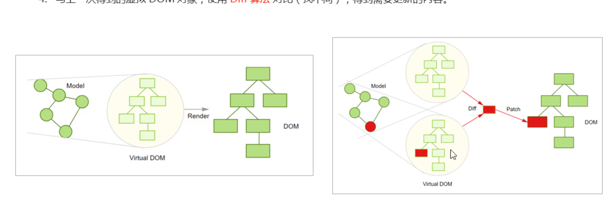
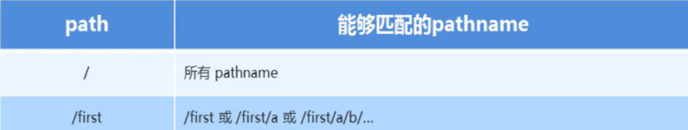

## 组件更新机制

```js
setState()的两个作用：
1.修改state
2.更新组件

// 当父组重新渲染时，也会重新渲染子组件，但只会渲染当前组件的子组件
```

---

## 组件性能优化

### 减轻state

```js
// 不用做渲染的数据不要放在state中，放在this中
class Hello extends Component {
  conpinentDidMount () {
    this.timerId = setInterval (() => {},2000)
  }
  conpinentWillUnmount () {
    clearInterval(this.timerId)
  }
  render () {}
}
```

### 避免不必要的重新渲染(sholdComponentUpdate钩子函数）

```js
// 使用钩子函数sholdComponentUpdate(nextProps, nextState)
// nextProps、nextState表示最新的数据
class Hello extends Component {
  sholdComponentUpdate() {
    return false
  }
}

// 通过返回值决定该组件是否重新渲染，返回true表示重新渲染，false表示不重新渲染
触发时机：更新阶段的钩子函数，sholdComponentUpdate => render
```

### 纯组件PureComponent

```js
// PureComponent内部自动实现了shouldComponentUpdate钩子，不需要手动比较
class Hello extends React.PureComponent {}
```

### 纯组件内部的对比时shallow compare（浅层对比）

```js
// 对于值类型来说，比较两个值是否相同
let num = 0
let newNum = num
newNum = 2
console.log(num === newNum) // false

// 对于引用类型，只对比对象的引用地址是否相同
const obj = { num: 0 }
const newObj = obj
newObj.num = 2
console.log(newObj === obj) // true

// state或props中属性值为引用类型时，应该创建新数据，不要直接修改原数据
const newObj = {...state.obj, num: 2 }
setState({ obj: newObj })

// 不要用数组的push/unshift等直接修改当前数组的方法，应使用concat或slice等这些返回新数组的方法
this.setState({
  // 或者ES6的结构赋值
  list: [...this.state.list, {新数据}]
})
```

---

## 虚拟DOM和Diff算法

```jsx
// 虚拟DOM就是一个JS对象，用来描述你希望在屏幕上看到的内容
const element = {
  type: 'h1',
  props: {
    className: 'greeting',
    children: 'Hello JSX!'
  }
}

```

1.初次渲染时，React会根据初始的state（model）和JSX，创建一个虚拟DOM对象（树）

2.根据虚拟DOM生成真正的DOM，渲染到页面中

3.当数据变化后（setState)重新根据新的数据，创建新的虚拟DOM树

4.于上一次得到的虚拟DOM对象，使用Diff算法，找不同，得到需要更新的新的内容

5.最终，React只将变化的内容更新(patch)到DOM中，重新渲染



```js
#render方法调用并不意味着浏览器进行渲染，而是意味着Diff算法开始比对了
虚拟DOM	=> state + JSX
虚拟DOM的真正价值不是提升了性能，而是让react脱离了浏览器的束缚，所以只要可以运行js的地方就可以运行React
```

---

## React路由

SPA单页应用程序

让用户从一个视图（页面）导航到另一个视图（页面）

是一套映射规则，是URL路径和组件之间的对应关系（从一个组件跳到另一个组件）

```jsx
// 1.安装
npm i react-router-dom

// 2.导入
import { BrowserRouter as Router, Route, Link } from 'react-router-dom'

// 3.使用Router组件包裹整个应用
<Router>
  <div>
  	<h1>React路由基础</h1>
	</div>
</Router>

// 4.使用Link组件作为导航菜单（路由入口）
<Link to="/first">页面一</Link>

// 5.使用Route组件配置路由规则和要展示的组件（路由出口）
const First = () => <p>页面一的内容</p>
<Router>
	<div>
  	<Link to="first"></Link>
    <Route path="/first" component={First}></Route>
  </div>
</Router>

#Router组件：包裹整个应用，一个React应用只需要使用一次
```

---

## 两种常用的Router

```js
// BrowserRouter和HashRouter
HashRouter:使用URL的哈希值实现，因为有警号比较丑陋一般不用
BrowserRouter: 使用H5的historyAPI实现，一般使用此方式
```

---

## 常用组件说明

```js
// Link组件：用于指定导航链接（a标签）
to属性：浏览器地址栏中的pathname(location.pathname)

// Route组件：指定路由展示组件相关信息
path属性： 路由规则
component属性： 展示的组件
Route组件写在哪，渲染出来的组件就展示在哪
```

---

## 路由执行过程

```js
1.点击Link组件，修改了浏览器地址栏中的URl
2.React路由监听到地址栏url的变化
3.React路由内部遍历所有的Route组件，使用路由规则path与pathname进行匹配
4.当路由规则path能够匹配地址栏中的pathname时，就展示该Route组件的内容
```

---

## 编程式导航

```js
// 通过js代码实现页面的跳转就是编程式导航
	// history是React路由提供的，用于获取浏览器历史记录的相关信息
	// push跳转到哪个页面
this.props.history.push('/home')

// 前进或后退到某个页面，参数n表示前进或后退页面的数量
this.props.history.go(-1)
```

---

## 默认路由 斜线/

```jsx
// 进入页面时就会匹配的路由 斜线/
<Route path="/" component={home}></Route>
```

---

## 模糊匹配模式

```js
// 只要pathname以path开头就会匹配成功
// path表示Route组件的path属性
// pathname表示Link组件的to属性
```



---

## 精确匹配

```jsx
// 给Route组件添加exact属性，让其变为精确匹配模式
// 只有当path和pathname完全匹配时才会展示该路由
<Route exact path="/" component=... />

#给默认路由加exact属性
```

