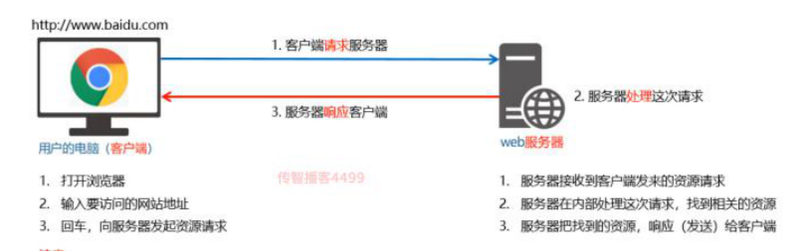
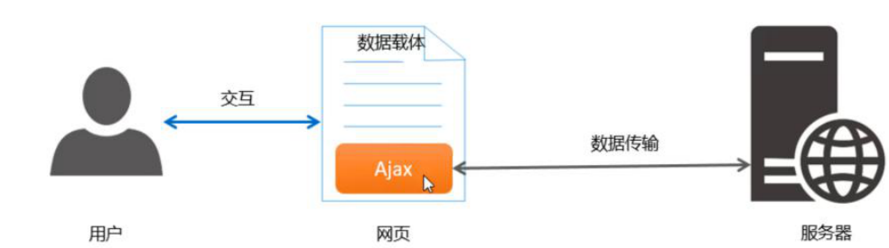
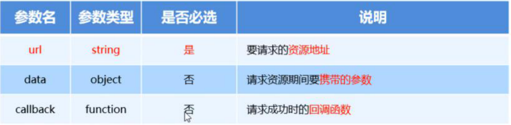
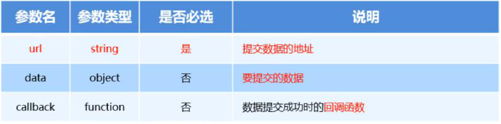
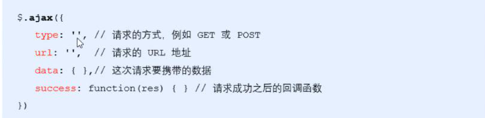

# 作用

ajax 主要是实现页面和 web 服务器之间数据的异步传输。

---

## 客户端与服务器

负责获取和消费资源的电脑，就叫做客户端

---

## URL地址的概念

称为统一资源定位符。

组成：

1.通信协议

2.服务器名称

3.在服务器上具体的存放位置

```js
http
//通信协议
www.cnblogs.com
//服务器名称
asdad/p/1232523.html
//服务器的存放位置
```

---

## 通信过程

注意：

1.分为 请求-处理-响应

2.网页中每一个资源都是通过请求处理响应的方式从服务器获取回来的



---

## 网页中常见的资源

文字内容

图片资源

音频资源

数据也是资源（股票/排行榜）

---

## HTML是网页的骨架

## CSS是网页的颜值

## Javascript是网页的行为

## 数据是网页的灵魂

---

## 如果要在网页中请求服务器上的数据资源

```js
var xhrObj = new XMLHttpRequest()
```

---

## 资源请求的方式

最常见的请求方式分为get和post

get请求通常用于获取服务器资源，如地址，HTML文件等

post用于向服务器发送资源，如用户登录信息

---

## Ajax的概念

能让我们轻松实现网页与服务器之间的数据交互



---

## jQuery中的Ajax

```js
$.get()//从服务器获取
$.post()//给服务器发送
$.ajax()//都可
```

---

## $.get()

```js
$.get(url,[data],[callback])
```



---

## $.post()

```js
$.post(url,[data],[callback])
```



---

## $.ajax()

```js
$.ajax({
//type可以不写，默认就是get
	type:'get',
	url:'http://www.liulongbin.top:3006/api/getbooks',
//data可以不写，上传数据时要写
	data:{id:1},
	success : (res) => console.log(res)
})
```



---

## 接口的概念

使用Ajax请求数据时，被请求的URL地址，就叫做数据接口，同时，每个接口必须有请求方式

---

## 接口测试工具postman

好处：在不写任何代码的情况下，对接口进行调试

---

## 接口文档

组成部分：

1.接口名称

2.接口URL

3.调用方式

4.参数格式

5.响应格式

6.返回示例

---

