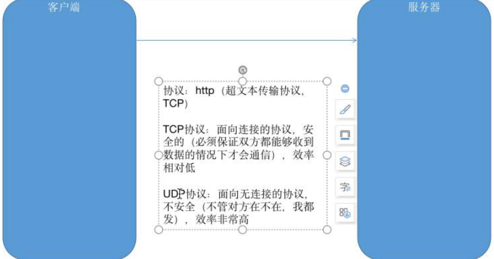
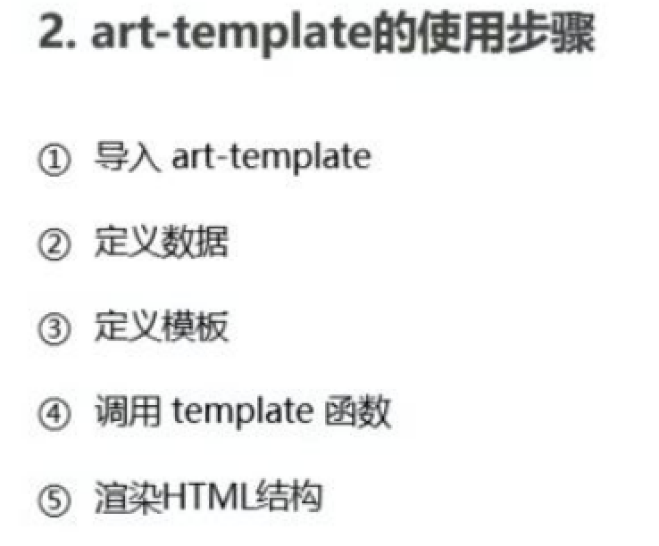
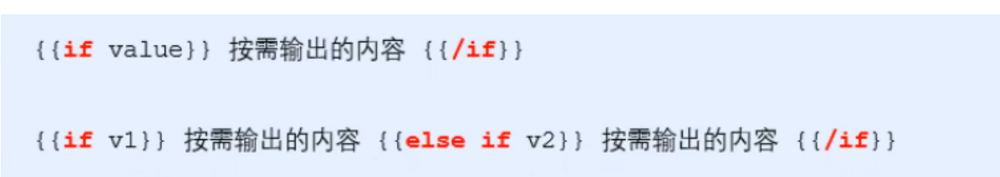
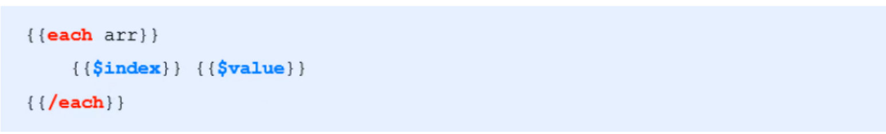
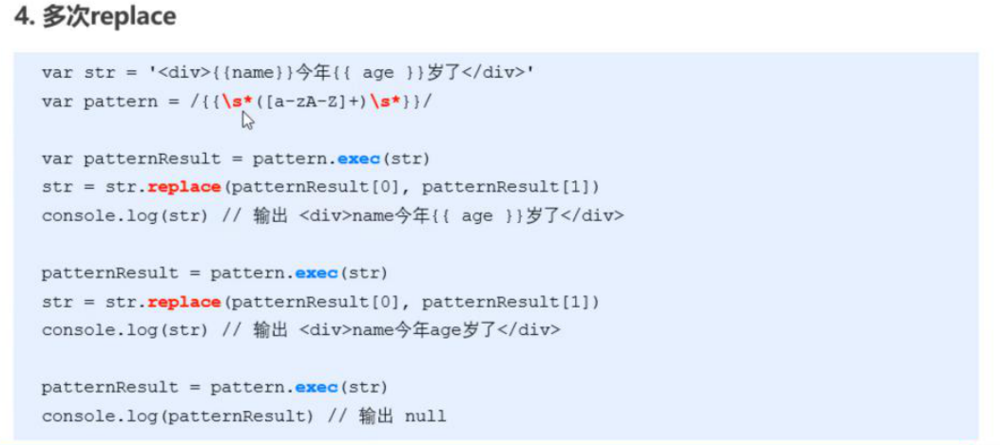

##   扩展



三次握手和四次挥手：

握手：客户端=>服务器=>客户端

挥手：客户端=>服务器=>客户端=>服务器

---

## 快速获取表单

```js
//表单必须要写name,且值唯一 JQuery方法
.serialize()
```

---

## 模版引擎

art-template是一个简约，超快的模版引擎

```js
template('模版的ID',需要渲染的数据对象)
```



---

## 标准语法-输出


---

## 标准语法-原文输出

```js
//包含了HTML标签结构，可以渲染HTML标签
{{@ value}}
```

---

## 标准语法-条件输出



---

## 标准语法-循环输出



---

## 标准语法-过滤器

```js
{{date | formydata}}//  | 是管道符
template.defaults.imports.方法名 = function(参数){}
```

---

## 正则与字符串操作

## exec()方法

```js
//得到的是那个字符，没有则null
正则表达式.exec(字符)
#返回的是个数组
```

---

## 分组

```js
//在正则表达式中（）包起来的内容表示分组
{{()}}
#可以单独提取小括号内匹配的字符串，返回结果为0 的是匹配到的内容，1是分组提取到的内容
作用：
1.提高优先级
2.在exec方法调用时，可以分组
```

---

## 替换replace()

```js
str = str.replace(替换谁，替换成什么)
```

---

## 多次replace操作



---

