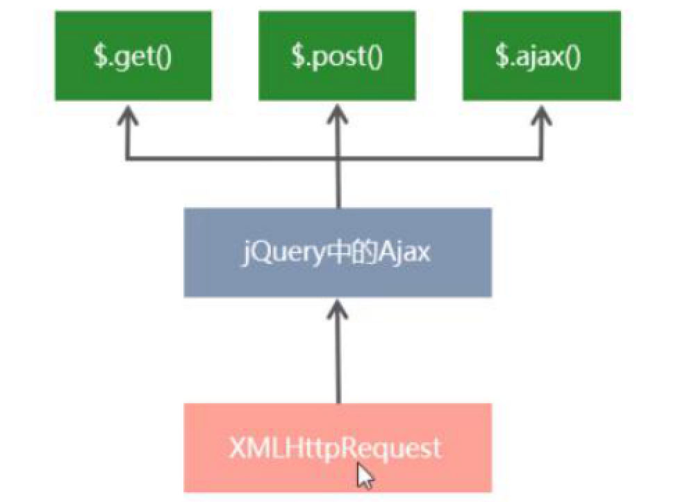
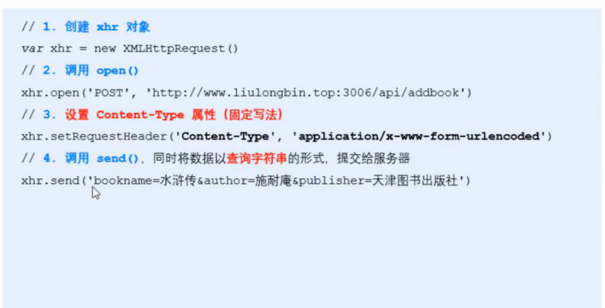
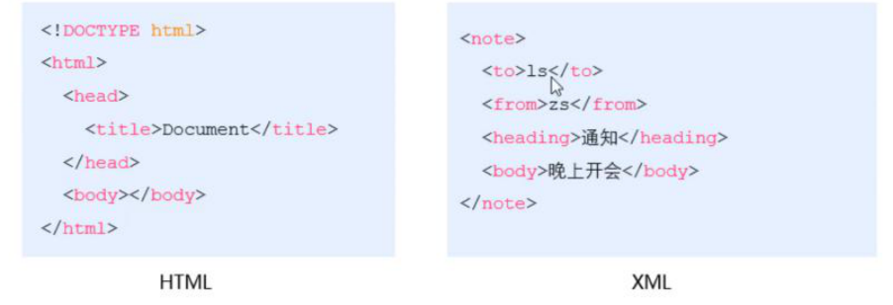

# ajax原理



---

## 步骤：

1.创建xhr对象

2.调用xhr.open()函数

3.调用xhr.send()函数

4.监听onreadystatechange事件

```js
xhr.onreadystatechange = function(){

if (xhr.readyState === 4 && xhr.status === 200) {//固定写法
  	console.log(xhr.responseText)
	}

}
```

---

## get请求传参数

```js
//在链接后面以？id=1&name=西游记
http://www.liulongbin.top:3006/api/getbooks?id=1
```

---

## 查询字符串

在链接后面以？开始，键值对的方式

---

## 编码(转义)

```js
encodeURI()//将中文转换成BASE64编码
decodeURI()//将BASE64编码转换成中文
```

---

## 使用xhr发起post请求



---

## XML

可扩展标记语言，是HTML的爸爸



html是被设计用来描述网页的内容，是网页内容的载体

XML是被设计用来传输和存储数据，是数据的载体

---

## JSON

全称JavaScript Object Notation

本质是个字符串

### 包含对象和数组两种结构:

数据结构为

对象：{key:value, key:value,...}

数组： ["java","javascript",30,true]

其中key必须要双引号包裹，value可以是布尔，null,字符串，数字型，数组，对象6种，其他不行，而且字符串必须双引号包裹

```js
//把JSON格式的字符串转换成JS对象 反序列化函数
JSON.parse()

//把JS对象转换成JSON格式的字符串 序列化函数
JSON.stringify()
```

### 注意事项


6⃣️.不能使用undefined或函数作为JSON的值

## 作用：

在计算机与网络之间存储和传输数据

---

## XHR Level2的特性

### 1.可以设置HTTP请求的时限

```js
//将最长的等待时间设置为3秒，当超过了3秒就认为失败了
xhr.timeout = 3000

//当请求超时时会触发事件
xhr.ontimeout = funciton(){
  
}
```

### 2.可以使用FormData对象管理表单数据

```js
var fd = new FormData()//实例
fd.append('uname','zs')//追加内容
fd.append('upwd','123456')
var xhr = new XMLHttpRequest()
xhr.open('POST','http://www.liulongbin.top:3006/api/formData')
xhr.send(fd)//传入
```

```js
//用FormData快速获取表单数据
var form = document.querySelector('#form')
form.addEventListener('submit',function(e){
  e.preventDefault()
  var fd = new FormData(form)
  var xhr = new XMLHttpRequest()
  xhr.open('post','http://www.liulongbin.top:3006/api/formData')
  xhr.send(fd)
  xhr.onreadystatchange = function (){
    if(xhr.readyState === 4 && xhr.status === 200) {
     console.log(JSON.parse(xhr.responseText))
    }
  }
})
```

### 3.可以上传文件

1.定义UI结构

2.验证是否选择了文件(用.files传入文件)

3.向FormData追加文件

```js
//将用户选择的文件添加到FormData中
var fd = new FormData()
fd.append('avatar',files[0])
```

4.使用xhr发起上传文件的请求

```js
var xhr = new XMLHttpRequest()
xhr.open('post','http://www.liulongbin.top:3006/api/upload/avatar')
xhr.send(fd)
```

5.完成上传文件的功能

```js
xhr.onreadystatechange = function (){
  if (xhr.readyState === 4 && xhr.status === 200) {
		var data = JSON.parse(xhr.responseText)
    if (data.status === 200) {
		//上传成功
      document.querySelector('#img').src = 'http://www.liulongbin.top:3006' + data.url
    }else {
      //上传失败
      alert('上传失败' + 'data.message')
    }
	}
}
```


### 4.可以获得数据传输的进度信息


---


### 