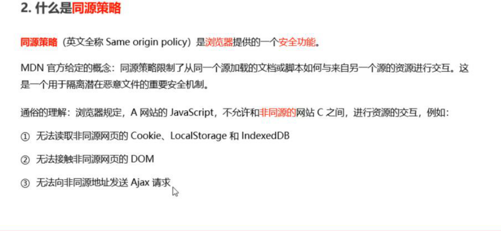
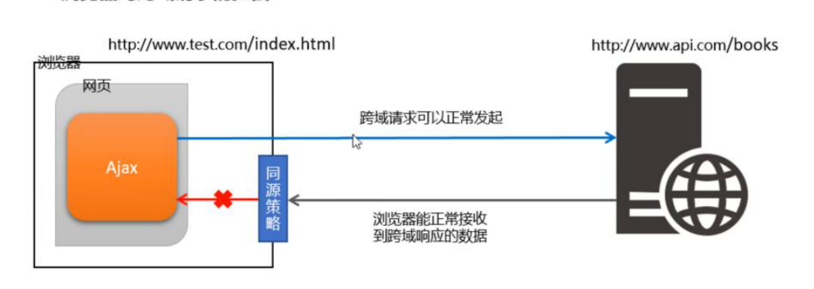

## 同源策略

### 同源：

如果两个页面的协议，域名和端口都相同，则两个页面具有相同的源	

### 什么是同源策略

是浏览器提供的一个安全功能，为了保障安全性



## 什么是跨域

不是同源则是跨域



---

## 实现跨域数据请求

JSONP（临时）和CORS（官方）

---

### JSONP的缺点：

1.只支持get请求

2.和ajax之间没有任何关系

---

## 使用JQuery发送JSONP请求

```js
 $(function(){
            $.ajax({
                url : 'http://www.liulongbin.top:3006/api/jsonp?name=月薪过万&hobby=给爷冲',
                dataType : 'jsonp',
                success : res => {
                    console.log(res);
                }
            })
        })
```

---

## 防抖策略

当事件被触发后，延迟n秒后再执行回调，如果在n秒内事件又被触发，则重新计时

## 缓存

当数据第一次加载时，存储，下一次使用时直接调用缓存中的数据，减少ajax请求

## 节流

节流策略，可以减少一段时间内事件的触发频率

### 节流的应用场景

鼠标连续不断的触发点击事件，只在单位时间内触发一次

懒加载时要监听并计算滚动条的位置，但不必每次都触发，可以降低cpu的使用频率

### 节流阀的概念

节流阀为空，表示可以执行下次操作，不为空，表示不能执行下次操作

当操作执行完，必须将节流阀重置为空

判断节流阀是否为空，如果不为空，表示上一次操作还没有完成

### 节流与防抖的区别

防抖：如果事件被频发触发，防抖能保证只有最后一次触发生效，前面n多次的触发都会被忽略

节流：如果事件被频繁触发，节流能够减少事件触发的频率