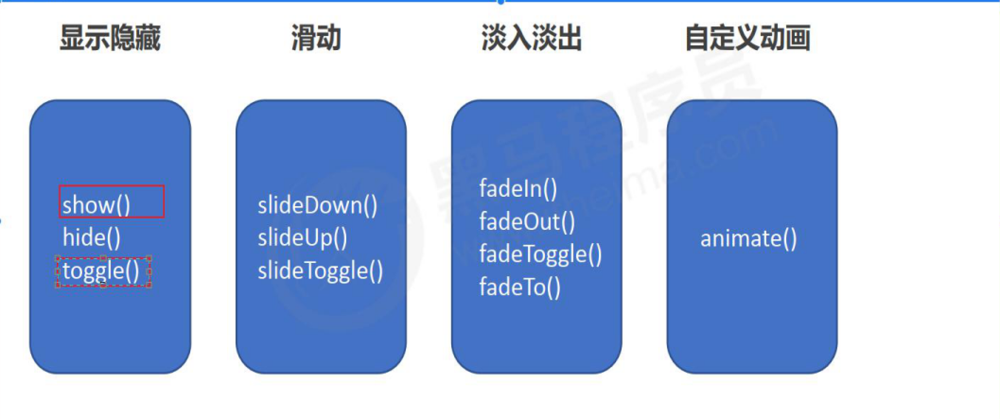

## jQuery样式操作

原生js的className会覆盖原先的类名

而jQuery里的addClass不会覆盖，而添加

---

## 动画效果



### 停止动画排队

```js
.stop()
//写在动画的前面
```

---

## jQuery属性操作

### 原有的属性(固有属性)

```js
//获取
.prop('属性名')

//设置
.prop('属性名',属性值)
```

### 自定义属性

```js
//获取
.attr('属性名')

//设置
.attr('属性名',属性值)
```

### 数据缓存date()

这个里的数据是存放在元素的内存里面

```js
//获取
date('属性名')
 
//设置
.date('属性名',属性值)
#获取H5自定义属性时属性名不用加date
```

---

## jQuery内容文本值

```js
//得到里面的内容（包括标签）
.html()

//更改里面的内容
.html('内容')

//得到里面的内容（不包括标签）
.text()

//更改里面的内容
.text('内容')

//得到里面的内容（input）
.value()

//更改里面的内容
.value('内容')
#案例 购物车
```

---

## 遍历

```js
//对同一类元素做不同操作要遍历
对象.each(function(索引号，DOM元素){
 $(DOM元素).css()
})

//或者
$.each(对象,function(索引号，DOM元素){
 $(DOM元素).css()	
})
#要操作DOM元素要改变为jQuery元素
#隐式迭代事对同一元素做相同操作
```

