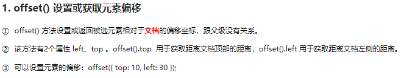
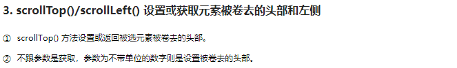

## 创建元素

```js
//创建元素
var li = $('<li>内容</li>')

//内部添加元素 放到最后面
$('父元素').append(li)

//内部添加元素 放到最前面
$('父元素').prepend(li)

//外部添加元素 放到后面
$('父元素').after(li)

//外部添加元素 放到后面
$('父元素').before(li)
#内部添加的元素相互之间是兄弟关系，外部添加的元素相互之间是父子关系

//删除元素（自己删自己）
ele.remove()

//删除该元素的子节点
ele.empty()

//删除该元素的子节点
ele.html('')
```

---

## jQuery元素大小


---

## 设置偏移

```js
//设置和获取元素偏移 
对象.offset()
#里面没有值时获取，里面写大括号写top和left时是设置

//position只能获取不能设置
对象.position()
```






动画必须是让元素做动画，不能以文档作为对象

---

## jQuery事件注册

```js
//on可以注册多个事件
$('div').on({
  mouseenter:function(){},
  click:function(){}
})
```

---

## jQuery事件委托

```js
//把事件委托给父元素
父元素.on('click','子元素',function(){})
```

---

## jQuery事件解绑

```js
//把点击事件解绑
对象.off('click')

//把事件委托解绑
父元素.off('click','li')
#不写参数时是解绑全部事件

//one事件 只能触发一次事件
```

---

## jQuery自动触发事件

```js
//自动触发的三种方式
元素.click()//不写参数
元素.trigger('click')
元素.triggerHander('事件')//不会触发默认行为
```

---

## 事件对象

```js
//阻止默认行为
event.preventDefault()或者return false

//阻止冒泡
event.stopPropagation()
```

---

## todolist

网站记事本

---


