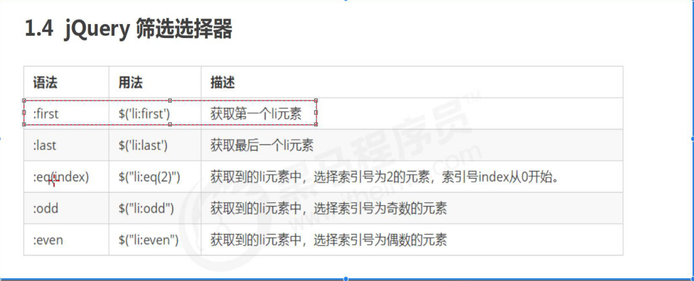
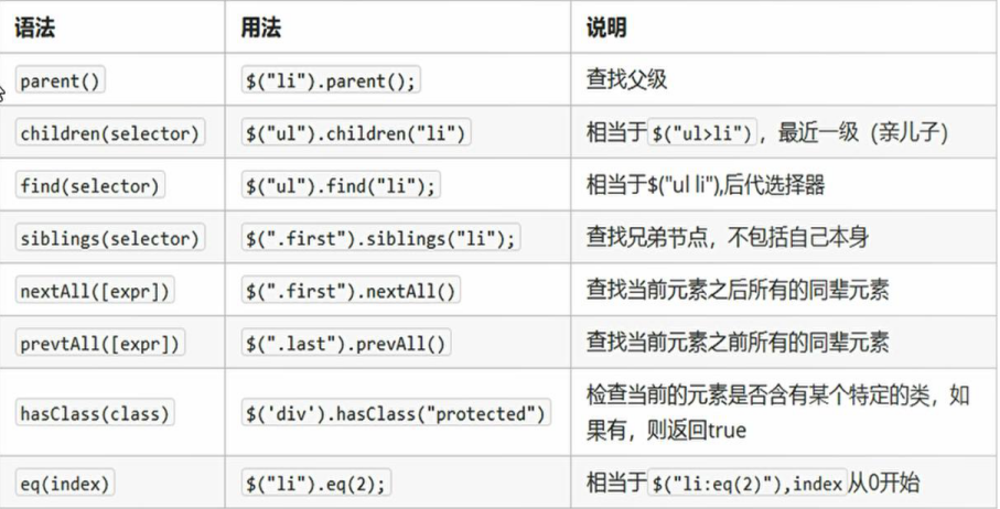

# jQuery就是javaScript库

---

## 入口函数

```js
//等DOM元素加载完成再执行
$(document).ready(function() {
  
})


//等DOM元素加载完成再执行
$(function(){
  //得到一个jQuery对象 并隐藏
  $('div').hide()
  })
```

---

## 区分jQuery对象和DOM对象

### DOM对象

通过原生的JS方法获取到的标签对象就是DOM对象

### jQuery对象

通过$('css选择器')这个方法获取到的对象，都是jQuery对象

jQuery中提供了大量的方法，它只能jQuery对象来调用

### jQuery对象与DOM对象的相互转换

```js
//DOM转换为jQuery
$(DOM对象)

//jQuery转换为DOM对象
jQuery对象[对应的下标]
//或者
jQuery对象.get(对应的下标)
```

---

## jQuery选择器

```js
$('css选择器')
```

---

## jQuery设置样式

```js
.css('属性','值')
```

---

## 隐式迭代

遍历内部DOM数组

---

## 筛选选择器



---

## siblings()

```js
//排它
.siblings()

//查找祖先元素
.parents('选择器')
```



---

## 设置类样式

```js
// 1.添加类
$("div").addClass("current");

// 2.删除类
$("div").removeClass("current");

// 3.切换类
$("div").toggleClass("current");

$('div').hasClass('current');
```

