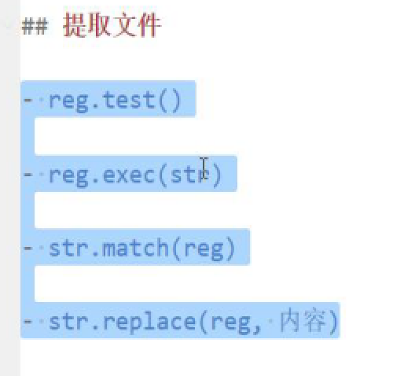

# node

基于v8引擎的js运行环境

---

## fs模块

fs模块是node.js官方提供的，同来操作文件的模块，它提供了一系列的方法和属性，用来满足用户对文件的操作需求

```js
fs.readFile()方法，用来读取指定文件中的内容
fs.writeFile()方法，用来向指定的文件中写入内容
```

### fs.readFile()的语法格式

```js
fs.readFile(path[,options],callback)
//[]里代表可选参数

const fs = require('fs')
fs.readFile('./files/11.txt','utf8',function(err,dataStr){
  //err代表失败的结果 成功返回null 失败返回对象
  //dataStr代表成功的结果 成功返回内容 失败报错
})
```

### fs.writeFile()的语法格式

```js
fs.writeFile(file,data[,option],callback)

const fs = require('fs')//导入模块
fs.writeFile('./files/2.txt','hello','utf-8',function(err){
 //调用方法写入内容 参数1 表示文件的存放路径，参数2 表示要写入的内容 参数3 是编码格式 可以省略 参数4 是一个回调函数
})
```

通过此模块操作都是异步的

---

## fs模块路径动态拼接问题

```js
//__dirname表示当前文件所处的路径
fs.readFile(__dirname + '/files/1.txt','utf8',function(err,dataStr){

})
```

---

## path路径模块

path是node.js官方提供的，用来处理路径的模块，它提供了一系列的方法和属性，用来满足用户对路径的处理需求

### 路径拼接

path.join()的语法格式

```js
path.join([...paths])

const pathStr = path.join('/a','/b/c','../','./d','e')
console.log(pathStr)//输出为/a/b/d/e ../会抵消一次前面离它最近的路径
```

以后凡是遇到路径拼接都适用path模块不使用加号

---

### path.basename()可以获取路径中的文件名

```js
const path = require('path')
const fpath = '/a/b/c/index.html'
const fullName = path.basename(fpath)
console.log(fullName)
const nemeWithoutExt = path.basename(fpath,'.html')
```

---

### path.extname()可以获取文件扩展名

```js
const path = require('path')
const fpath1 = '/a/b/c/index.html'
const fext = path.extname(fpath1)
console.log(fext)
```

---

### 注意点

1.写入时如果写入的文件里有内容会被新内容覆盖。

2.提取文件时如果要存放在某个文件夹必须要有那个文件夹。

---

## 提取文件的方法

