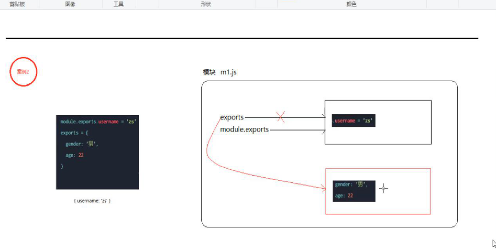

## 正则的断言

```js
// ?=表示先行断言 ?!表示先行否定断言（前面不是空白字符） ?<=后行断言 ?<!后行否定断言（后面不是空白字符）
const str = 'hello world'
const reg = /\w+(?=\s)/
const res = reg.exec(str)//hello

const str = 'hello world'
const reg = /\w+(?<=\s)/
const res = reg.exec(str)//world
```

---

## 创建基本的web服务器

1.导入http模块

```js
const http = require('http')
```

2.创建一个实例

```js
const server = http.createServer()
```

3.为服务器实例绑定request事件(监听客户端的请求)

```js
server.on('request',(req,res)=>{//request是个事件，是固定的不可改变
  console.log('Someone visti our web server')
//  req是一个请求对象
//  res是一个响应对象
})
```

4.启动服务器

```js
server.listen(80,()=>{//80表示端口号，如果是80可以被省略
  console.log('http server running at http://127.0.0.1')
})
```

---

## req请求对象

包含req.url和req.method就是请求的地址和请求的类型

---

## res响应对象

如果想访问与服务器相关的数据或属性可以使用res响应对象

```js
//res.end()方法是响应一些内容
```

---

## 解决中文乱码的问题

当使用res.end()方法发送中文内容时会出现乱码

需要设置响应头，如下：

```js
res.setHeader('Content-Type','text/html; charset=utf-8')
#也可以解析html代码
```

---

## 根据不同的URL响应不同的内容

1.获取请求的地址

2.设置默认的内容为404

3.判断请求是否为/来进入首页

4.判断其他页面

5.设置响应头防止乱码

6.用res.end()把内容响应给客户端

---

## 自定义模块

在使用require加载用户自定义模块期间可以省略后缀

---

## node.js中的模块作用域

在自定义模块中定义的变量和方法只能在当前模块内被访问

解决了全局变量冲突（污染）

---

## 向外共享模块作用域中的成员

### 1.module对象

```js
module.exports.属性名 = 属性值 将模块内的成员共享出去
#属性值写模块里的某个变量名则可以达到访问那个变量名的目的
```

导入的结果永远以module.exports指向的对象为准,如下：

```js
module.exports = {}
```

由于module.exports写起来比较复杂，为了简化可以用exports.共享

```js
exports.属性名 = 属性值
#但是导入的结果永远以module.exports指向的对象为准
```



---

## 关于npm

### 包

node.js中第三方模块又叫做包

从https://www.npmjs.com/下载包

---

### 装包

```js
npm install 包的完整名称

//简写
npm i 完整的包名称
```

---

#### 安装指定版本的包

```js
npm i moment@2.22.2
//通过@的方式选择
```

---

## 模块的分类

1.内置的

2.自定义的

3.第三方的