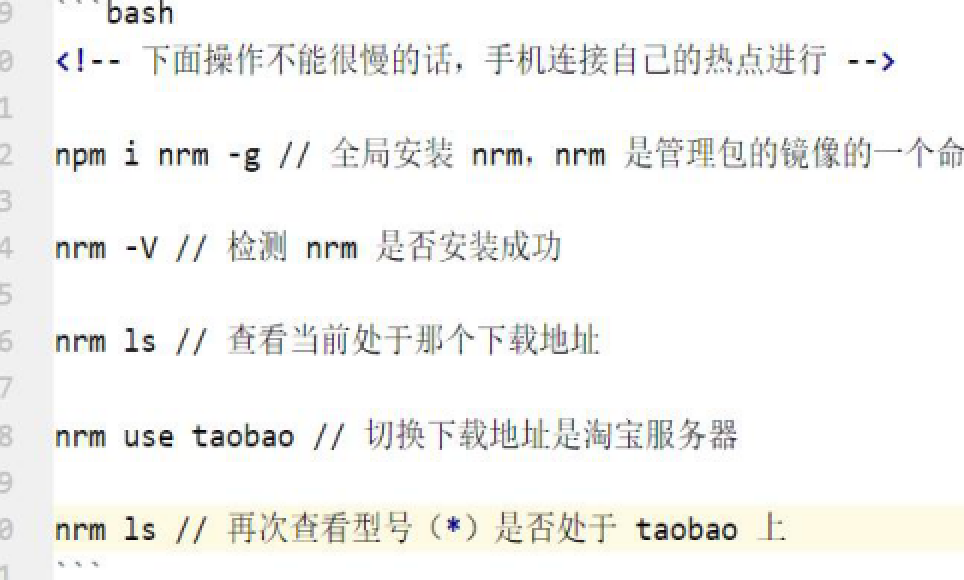

## 包管理文件

```js
//创建
npm init -y
```

### 流程：

1.npm init -y 

2.npm i 包名称

3.gitignore 里配置忽略文件

4.拉取代码后执行 npm i 安装所有的包

---

### dependencies节点

用来记录安装了哪些包

---

### 卸载包

npm uninstall 包名称

---

### devDependencies节点

如果某些包只在项目开发阶段会用到，上线后不会用到，则建议记录到此节点中

```js
npm i 包名称 -D
```

---

## 解决下载包过慢的方法



---

## 全局包

如果在安装npm i 包名称后面提供了-g怎么代表用的是全局包

### 卸载

在npm uninstall 包名称 -g全局卸载

注意：只有工具性质的包，才有全局安装的必要性，因为他们提供了好的终端命令

---

## 包的分类

i5ting_toc是一个可以把md文件转换成html的小工具

```js
i5ting_toc -f 需要转换的md文件路径 -o
```

---

## 内置模块加载机制

内置模块是最高的

---

## Express简介

是基于Node.js平台的Web开发框架

---

## 能做什么

可以方便快速的创建Web网站和API接口的服务器

---

## 创建最基本的Web服务器

```js
//导入expres
const express = require('express')

//创建web服务器
const app = express()

//监听请求
app.get('/',(req,res) =>{
  res.end('hello')
})

//启动web服务器
app.listen(80,()=>{
console.log(express server running at http://127.0.0.1)
 })
```

### 通过app.get()方法，可以监听客户端的get请求

```js
app.get('/user',(req,res) => {
  //调用express提供的res.send()方法，向客户端响应一个JSON对象
res.send({name : 'zs',age : 20,gender : '男'})
})
```

### 通过app.post()方法，可以监听客户端的post请求

```js
app.post('/user',(req,res) => {
//调用express提供的res.send()方法，向客户端响应一个文本字符串
res.send('请求成功')
})
```

---

## 如何获取URL中携带的查询参数

通过req.query对象

```js
app.get('/',(req,res) => {
console.log(req.query)
})
```

---

## 获取url中的动态参数

```js
app.get('/user/:id/:name',(req.res) => {
  //这里的id是个动态参数
  console.log(req.params)
  res.send(req.params)
})
```

req.params默认是一个空对象，里面存放着通过：动态匹配到的值

---

## express.static()托管静态资源

```js
app.use(express.static('目录'))
//访问目录下所有的文件,但不会访问此目录
#托管多个静态资源时以第一个托管的为准

//挂载路径前缀
app.use('/abc',express.static('目录'))
```

---

## 模块的加载机制

### 第三方：

先从node_nodules文件夹找，然后逐层往上

### 自定义模块：

要以./或../指定，如果没有则会以内置模块或第三方模块找，所以必须指定

以js,json,node找