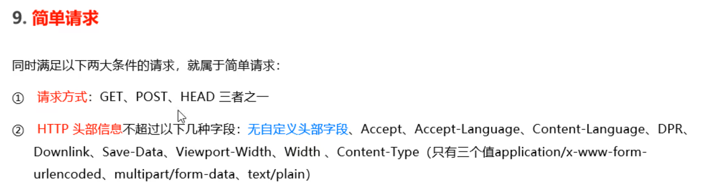
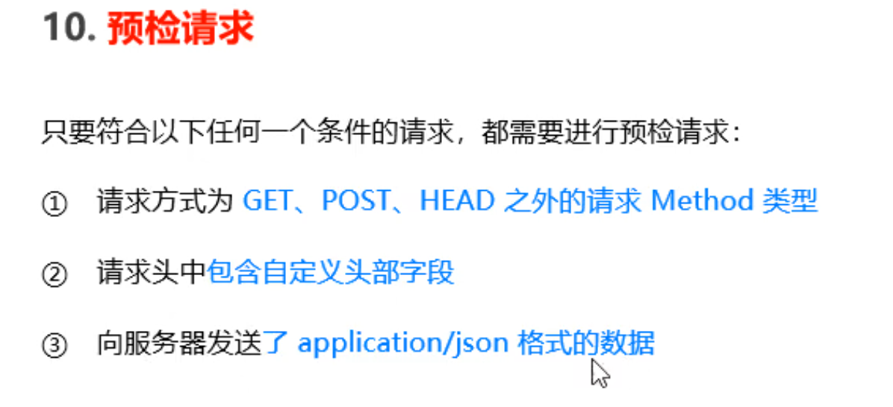

## 路由的模块化

为了方便模块化的管理，不建议直接挂载在app上，而是推荐将路由抽离为单独的模块

1.创建对应的js文件

2.调用express.Router()函数创建路由对象

3.向路由对象上挂载具体的路由

4.使用module.exports暴露

5.引用

---

## 为路由模块添加前缀

```js
app.use('/files',router)
```

---

## 中间件

### 流程

当一个请求到达express的服务器之后，可以连续调用多个中间件，从而对这次请求进行预处理

### 格式

本质上是一个function处理函数

```js
//有next的就是中间件处理函数
function(req,res,next){
next()
}
//next函数是实现多个中间件连续调用的关键，它表示把流转关系转交给下一个中间件或路由
```

---

## 全局生效的中间件

```js
//通过app.use()函数生效
const mw = function(req,res,next){
console.log('全局生效的中间件')
 next()
}
app.use(mw)
```

只写一个普通的请求函数当匹配到后不会走下面的请求，用中间件函数可以让下面的请求函数也请求

---

## 中间件的作用

多个中间件之间，可以共享同一份req,res，基于这样，我们可以在上游的中间件中，统一为req或res对象添加自定义的属性或者方法，供下游的中间件或路由进行使用

```js
//可以简化书写
app.use((req,res,next) =>{
  const time = Date.now()
  req.time = time
  next()
})
app.get('/',(req,res) =>{
	res.send('Home page' + req.time)
})
app.get('/user',(req,res) =>{
	res.send('Home page' + req.time)
})
```


---

## 定义多个全局中间件

```js
const express = require('express')
const app = express()
app.use((req,res,next) =>{
console.log('调用了第一个')
next()
})
app.use((req,res,next) =>{
console.log('调用了第二个')
next()
})
app.get('/user',(req,res)=> {
res.send('Home Page')
})
app.listen(80,()=>{
console.log('http://127.0.0.1')
})
```


---

## 局部生效的中间件

不实用app.use()定义的中间件，叫做局部生效的中间件

```js
app.get('/',局部生效中间件,(req,res)=>{
  res.send('')
})
```

---

## 中间件的应用场景

1.可以挂载请求信息

2.网站的维护公告

---

## 中间件的分类

### 1.应用级别的中间件

通过app.use()或者app.get()或者app.post()，绑定到app实例上的中间件

### 2.路由级别的中间件

绑定到express.Router()实例上的中间件

### 3.错误级别的中间件

专门用来捕获整个项目中发生的异常错误，从而防止项目异常崩溃的问题

格式:

```js
app.use(function(err,req,res,next){
  console.log('发生了错误' + err.message)
  res.send('Error!' + err.message)
})
#错误级别的中间件必须注册在所有路由之后
```

### 4.内置的中间件

```js
express.static快速托管静态资源
express.json解析JSON格式的请求体数据
express.urlencoded解析URL-encoded格式的请求体数据
```

在服务器，可以通过req.body这个属性，来接受客户端发送过来的请求体

### 5.第三方的中间件

1.安装中间件

2.导入

3.用use使用

---

## 自定义中间件

1.定义中间件

2.使用app.use监听req的data事件，拼接出完整的信息

3.监听req的end事件，信息接收完成后，触发end事件，转换成js对象然后用next把关系转给路由

---

## 基于express写接口

```js
#路由模块
//导入
const express = require('express')
//获取router
const router =  express.Router()
//给router挂载请求
router.get('/get',(req,res) =>{
  //取得查询字符串
    const query = req.query
    //返回给客户端的数据
    res.send({
        status : 0,//0表示处理成功，1表示失败
        msg : 'GET 请求成功',
        data : query//需要响应给客户端的数据

    })
})
//挂载post请求
router.post('/post',(req,res)=>{
  //在客户端添加数据
    const body = req.body
    res.send({
        status : 0,
        mag : 'POST 请求成功',
      //返回数据
        data : body
    })
})
module.exports = router//暴露
```


---

## 跨域

使用cors中间件解决跨域问题

1.安装cors中间件

2.使用const cors = require('cors')导入中间件

3.在路由之前调用app.usr(cors())配置中间件

```js
const cors = require('cors')
app.use(cors())
```

---

## CORS响应头

```js
//*表示任何的都可以访问，要限制可以设置
res.setHeader('Access-Control-Allow-Origin','*')


//如果发送了额外的请求头信息，则需要再服务器端通过Access-Control-Allow-Headers对额外的请求头进行声明，否则会失败
res.setHeader('Access-Control-Allow-Headers','Content-Type,X-Custom-Header')	 

//默认情况下，CORS仅支持客户端发起GET,POST,HEAD请求，如果希望通过PUT，DELETE等方式请求服务器的资源，则需要在服务器端，通过Access-Control-Allow-Methods来指明实际请求所允许使用的HTTP方法
res.setHeader('Access-Control-Allow-Methods','POST,GET,DELETE,HEAD')
```

---

## CORS请求的分类

### 简单请求



### 2.预检请求



## 简单请求和预检请求的区别

简单请求只会发送一次请求

预检请求会发两次，第二次为真正的请求

---

## JSONP的概念和特点 

1.不属于真正的Ajax请求

2.只能发送get请求

### 注意事项：

如果已经配置了CORS跨域资源共享，那JSONP必须在其之前配置

```js
app.get('/api/jsonp',(req,res)=>{
//定义JSONP具体的接口
  //1.获取客户端发送过来的回调函数的名字
  const funcName = req.query.callback
 	//2.得到要通过JSONP形式发送给客户端的数据
  const data = { name : 'zs',age : 22}
  //3.拼接出一个函数调用的字符串
  const scriptStr = `${funcName}($JSON.stringify(data)})`
  //4.把拼接出的字符串响应给<script>标签进行解析
  res.send(scriptStr)
})


//为JSONP按钮绑定点击事件处理函数
$('#btnJSONP').on('click',function(){
  $.ajax({
    type : 'get',
    url : 'http://127.0.0.1/api/jsonp',
    dataType : 'jsonp',
    success : res=>{
console.log(res)
    }
  })
})
```


---

