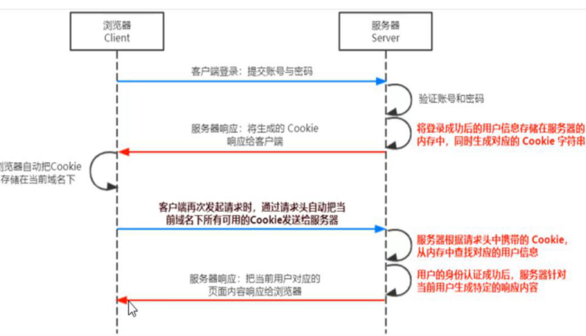
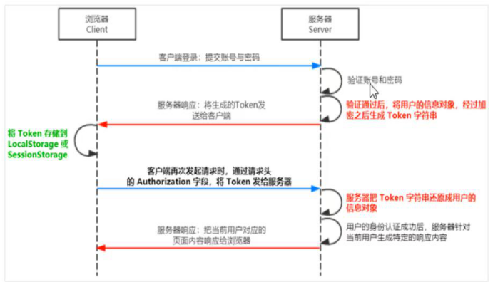

## web开发模式

1.服务器渲染

2.客户端渲染

---

## 身份认证

身份认证又称为身份验证，鉴权

对于服务器渲染推荐使用Session认证机制

前后端分离推荐使用JWT认证机制

---

## HTTP协议的无状态性

客户端每次请求都是独立的，连续多个请求之间没有直接的关系，服务器不会主动保留每次HTTP请求的状态

## 什么是Cookie

是存储在浏览器的不超过4KB的字符串，由一个名称（健），一个值（值）和气态几个用于控制Cookie有效期，安全性，使用范围的可选属性组成

不用域名下的Cookie各自独立，每当客户端发送请求时，会自动把当前域名下的Cookie一同发送到服务器

### Cookie几大特性

1.自动发送

2.域名独立

3.过期时限

4.4KB限制

---

## Cookie不具有安全性

因为它是存储在浏览器中的，浏览器也提供了读写Cookie的API，因此很容易被伪造

所以不要用Cookie存储重要的数据

---

## 提高安全性

## Session过程(原理)

1.输入了用户名和密码，会将用户信息提交到服务端

2.服务端根据此用户信息生成了唯一的SessionID，并且把此SessionID通过响应头的方式种植到前端的Cookie里面

3.后续所有的请求都会在请求头里面自动带上这个Cookie

4.后端拿到这个ID之后进行校验，成功后就认为你登录过了，可以对前端进行相应数据的操作



---

## 在Express中使用Session认证

1.安装 express-session

2.注册 

3.配置

```js
var session = require('express-session')
app.use(session({
	secret : 'Jason',
  resave : false,
  saveUninitialized : true
}))
```

### 清空session

调用destroy()函数只会清空当前用户，不会清空其他用户

---

## JWT认证机制



1.输入了用户名和密码，将信息提交给服务器

2.服务端根据用户信息生成token返回给客户端

3.客户端拿到token后存到本地

4.后续所有认证需要认证的请求都在请求头上带上token，服务端会把token获取过来进行解析，解析成功则允许后续的操作

---

## JWT三个组成部分

### 1.Header头部

安全性相关部分

### 2.Payload有效荷载

真正的用户信息

### 3.Sqgnature签名

安全性相关部分

三者之间用 . 分隔

---

## JWT的使用方式

客户端收到返回的JWT后，会把它存储在本地。

之后每次通信都要带上这个JWT的字符串

```js
Authorization:Bearer <token>
```

---

## 在Express相关的包

### 1.安装并导入JWT相关的包

```js
const jwt  = require('jsonwebtoken')//生成token 加密
const expressJWT = require('express-jwt')//解析token 解密
```

### 2.定义secret密钥

```js
//生成JWT字符串需要用secret密钥对信息进行加密
//把JWT字符串转换回来的时候需要哟过secret密钥对信息进行解密
const secretKey = 'itheima No1 ^_^'
```

### 3.在登录成功后生成JWT字符串

```js
//调用jsonwebtoken包提供给的sign()方法，将用户信息加密成JWT字符串，响应给客户端
const tokenStr = jwt.sign({username = userinfo.username},secretKey,{expiresIn : '60s'})
//第一个是用户的信息，第二个是加密的密钥，第三个是配置信息，过期时间
```

---

https://www.processon.com/view/link/5fa7cae0e0b34d7a1a9d70b7#map