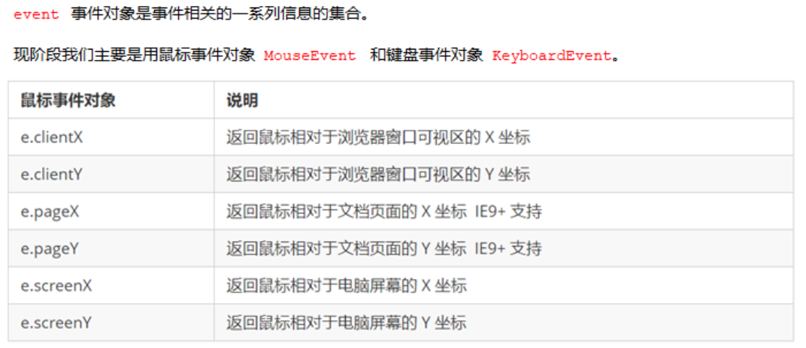

# Apis（应用程序编程接口）

----------------------------------------------------------------------------

## DOM文档对象模型

对HTML页面上的元素进行增删改查

## BOM浏览器对象模型

操作浏览器

----------------------------------------------------------------------------

## 获取标签的方法

```js
document.getElementById('id属性的值')
//通过id属性的值来获取元素,返回的是个对象
document.getElementsByTagName('标签名')
//通过标签名获取一类元素，可以获取多个，返回的是个伪数组
document.getElementsByClassName('类名')
//通过类名获取一类元素，但是只支持IE9以上版本
document.querySelector('名')
//根据指定选择器返回第一个元素，需要注意 '名' 里填的如果是类名前面要加点，id选择器前面加#
document.querySelectorAll('名')
//返回的是指定选择器的所有元素对象，也是一个伪数组
#querySelector可以选择所有的选择器，但是需要加点或者#
document.documentElement
//获取html标签
document.body
//获取body标签
```

---

## 事件三要素

```js
//1.获取事件源
var btn = document.getElementById('btn')
//2.注册时间，事件类型，如何触发,鼠标点击还是键盘按下
//3.事件处理程序
btn.onclick = function () {
  alert('')
}
```

### 鼠标事件



### 改变元素的内容

```js
标签名.innerText
//获取里面的内容
标签名.innerHtml
//获取里面的内容
#区别：获取时，innerText回去除空格和换行，innerHtml回保留；设置时，innerText不会解析标签，而innerHtml回解析标签。
```

---

## 常用元素的属性操作


#### 获取属性的值

```js
元素对象.属性名
```

#### 设置属性的值

```js
元素对象.属性名 = 值
#案例 分时问候
```

---

## 操作表单的属性

```js
input.value = ''
//表单里的文字内容是通过value修改的
元素对象/this.disabled = true//在js中它的属性值等于它本身的用true或者false表示,this表示指向这个函数
//被禁用
#案例 仿京东
```

---

## 操作行内样式

```js
对象.style.css属性
//如果css属性是由多个单词命名则使用小驼峰命名法
```

---

## 操作class属性

```js
元素对象.className = '类名'
//当操作的属性很多的时候在css里添加一个类名，以此来调用该类名，实现操作属性的目的
#案例 显示与隐藏	
```

---

