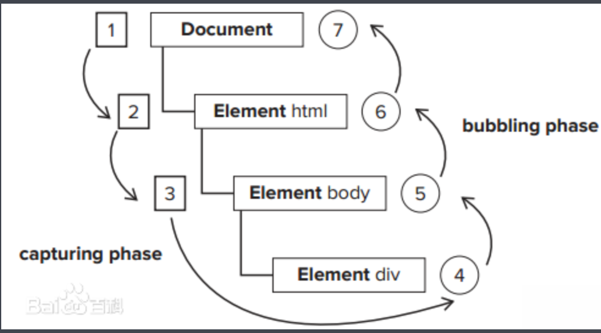
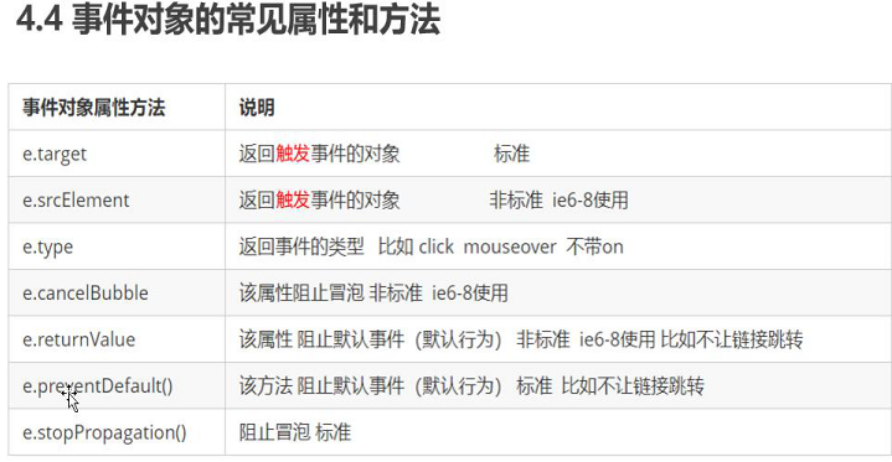

## 删除节点

```js
父对象.removeChild(要删除的元素)
//不能自己删自己，要在父对象里删除
#不能删除后添加的节点

自己.remove()
//可以自己删除自己,括号里不用写东西
#案例 删除留言
```

---

```js
.trim()
//去除input里两边的空格
```

---

## 不触发a标签的跳转行为的方法

```js
<a href = "javascript:;"></a>
```

---

## 克隆节点

```js
node.cloneNode(true)
//如果括号里什么都不写则不复制里面的内容，只复制内容，括号里为true时可以复制里面的内容
```

---

## 三种动态创建元素的区别

### document.write()

在文档中写入一个标签,但文档流会导致页面重绘

### innerHTML

本身不会创建标签，但可以解析html代码，不采取拼接字符串采取数组的方式创建效率会高一些

### document.createElement()

创建多个元素效率会低一些，但是结构清晰

---

## DOM重点核心

### 增

```js
appendChild()
insetBefore()
```


### 删

```js
父元素.removeChild(子元素)
自己.remove()
```


### 改

```js
src.href.title.value
style className
//修改样式
```


### 查

```js
getElemengtById.......
querySelector,querySelectorAll
//获取
partentNode,children
//节点
```

---

---

## 事件高级

### 注册事件(方法监听注册事件)



```js
.addEventListener('事件名',事件处理程序,[事件冒泡还是事件捕获])
//事件名不用带on等前缀	
//可以给一个事件注册多个程序
//第三个参数默认值时false,默认就是冒泡，从里往外这个顺序进行触发的；如果为true就表示时事件捕获，从外往里这个顺序触发
//只支持ie9以上
.attachEvent()
//ie9以前的版本支持
```

---

## 删除事件

```js
//传统方式
divs[0].onclick = null
//方法监听注册方式
divs[0].removeEventListener('click',fn)
//此处fn和fn1为调用函数并且不用小括号
divs[0].detachEvent('onclick',fn1)
#用哪种方式注册就用哪种方式解绑
```

---

## 事件对象

```js
#不需要实参，是系统自动创建的
function (event/evt/e) {
  console.log(event/evt/e)
  //返回的是事件的信息
  var e = e || window.event
//兼容性写法
}
//支持ie9
#案例 星星
```



## this和e.target的区别

```js
//e.target返回的是触发的事件
//this返回的是绑定的事件
```

---

## 删掉新添加的元素（事件委托）

```js
//将事件委托给其父元素
ul.addEventListener('click',function(e){
  //获取到事件发生的那个对象
  e.target.remove()
})

```

