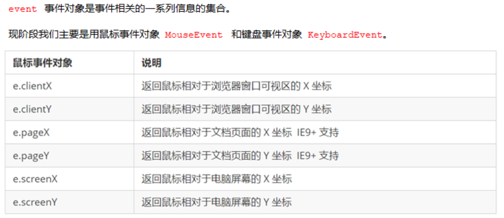

##  阻止默认行为(如 a链接的跳转)

```js
return false
//传统方式

e.preventDefault()
//监听器阻止
```

最简单的方法：不要给form注册onsubmit事件，先把提交按钮修改修改为普通按钮，然后给按钮注册单击事件

---

## 阻止冒泡

```js
e.stopPropagation()
//不会向上传递 常用

e.cancelBubble = true
//ie678
```

---

## 禁止右键菜单和选中复制

```js
document.addEventListener('contextmenu',function (e) {
  e.preventDefault()
})
//contextmenu菜单，preventDefault禁止默认

document.addEventListener('selectstart',function (e) {
  e.preventDefault()
})
//selectstart选中文字，preventDefault禁止默认
```

---

## 鼠标事件对象



---

## 键盘事件


```js
document.addEventListener('keyup/keypress/ketdown',function(e){
  console.log(e.keycode)
})
//返回ASKII值,但keypress区别大小写，其他的不区分
```

---

## 聚焦

```js
secrch.foucs()
#案例 模拟京东
```

---

---

## BOM（浏览器对象模型）

顶部对象是window

```js
window.onload = function () {
  
}
//加载事件，页面内容全部加载完了才会执行里面的事件
#两个一起用会冲突
```

---

## 窗口加载事件

```js
document.addEeventListener('DOMContentLoaded',function() {})
//DOMContentLoaded是加载DOM元素就会执行
```

---

## 调整窗口大小事件

```js
window.onresize = function () {}
window.addEventListener('resize',function (){})
//调整窗口大小加载事件,  当触发时就调用的处理函数

windwo.innerWidth
//当前屏幕的宽度
#主要做响应式布局时会用到
```

---

## 定时器

```js
setTimeout(参数1，参数2)
//当时间到了就会执行里面的函数体,括号里可以写一个代码或者函数，毫秒时间，但这个代码只会执行一次，第一个参数为方法或者代码，第二个参数为时间
#只会执行一次

setInterval(参数1，参数2)
//时间结束后继续倒计时

clearTimeout(定时器名)
//清除定时器

clearInterval(定时器名)
//清除定时器
```

---

## 回调函数

```js
function fn (callback) {
  callback()
}
fn (function(){
  console.log('ok')
})
//把一个函数作为参数传递给另一个函数，就称之为回调函数
```

