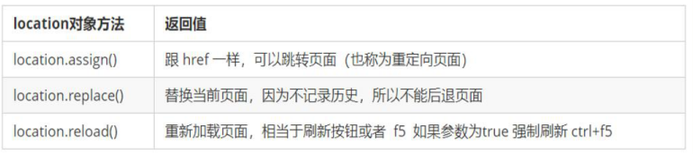
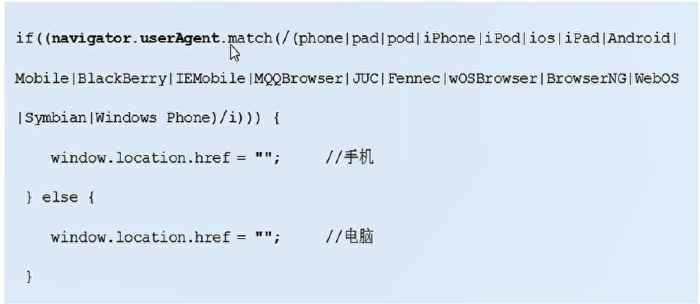
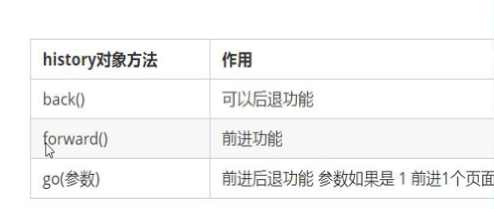
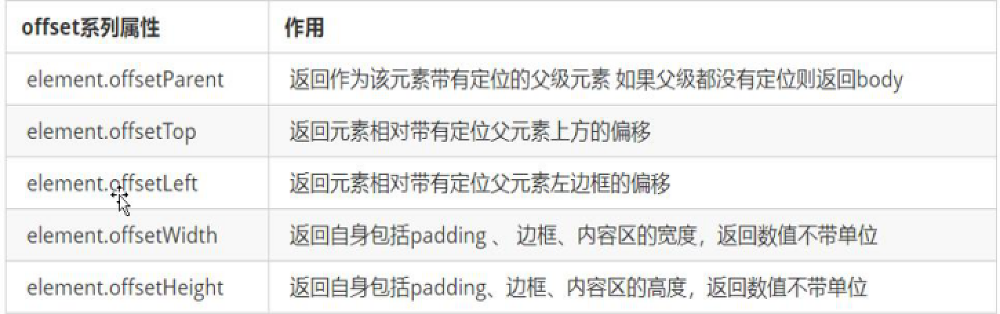

## this问题

```js
#在定时器里不能使用this，因为定时器是window对象，会指向window
#方法里this指向构造函数的实例
```

---

## 单线程

### 同步

一次只能做一件事，需要排队，在主线程里，先执行

### 异步

回调函数会放到移步队列里，当主线程任务完成后才执行

---

## confirm()

```js
window.confirm('字符串')
//这个方法有两个按钮，一个是确定，一个是取消。确定返回true，取消返回fslse
```

---

## location对象


```js
console.log(location.href)
//获取
#案例 表单提交 重点location.search
```

---



```js
location.assign('域名')
//跳转，有历史记录，可后退

location.replace('域名')
//替换，无历史记录，无法后退

location.reload(true)
//重新加载，相当于刷新
```

---

## navigator对象



```js
#可以判断用户用哪个终端打开页面，实现跳转
```

---

## history对象



---

## offset偏移量

使用该属性可以动态的获得该元素的位置，大小等



offset是只读，只能获取，不能赋值和更改

```js
#案例 膜态框 放大镜
```


---

