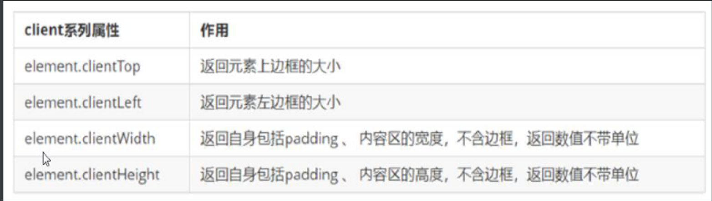
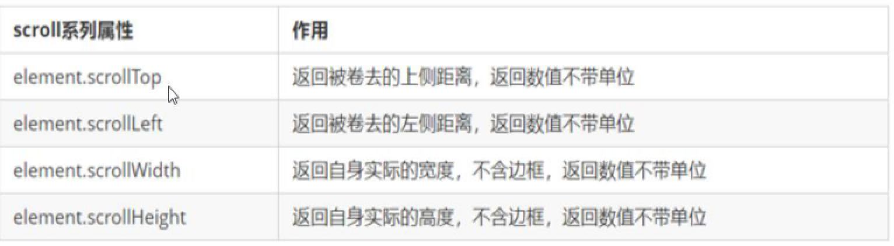
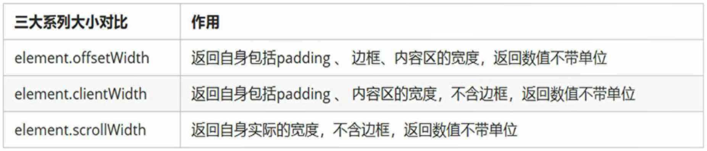
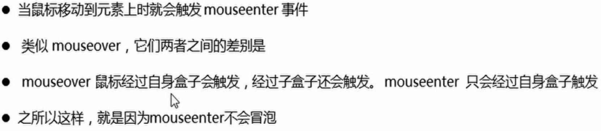

## 元素可视区client系列



---

## 立即执行函数

```js
(function(){})() 或者 (function(){}())
//不需要调用，立马能够自己执行的函数称为立即执行函数
//第二个小括号可以看作是调用函数
#如果有多个立即执行函数要以；结尾，以表示是两个立即执行函数
//立即执行函数最大的作用就是独立创建了一个作用域，里面所有的变量都是局部变量，不会有冲突的情况
```

---

## scroll滚动系列



```js
addEleventListener('scroll',function(){
	
	})

#window.pageYOffset来获取整个页面被卷去的大小
#案例 固定侧边栏
```

---

## 三大系类



---

## mouseenter和mouseover

都是鼠标经过时触发，但mouseenter不会冒泡，而mouseover会冒泡



离开mouseleave,mouseout

---

## 动画实现原理

通过定时器不断增加有定位的盒子的距离

---

