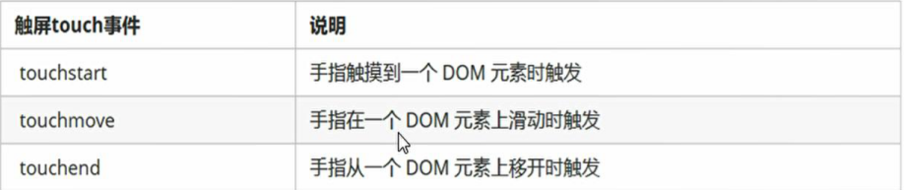
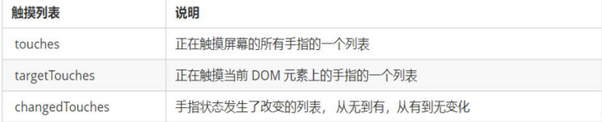

# 移动端事件

## 触屏事件touch 



---

## 触摸事件对象



---

## transitionend事件

判断是否完成过渡

---

## classList

返回元素的类名

用于在元素中添加，移除以及切换CSS类

```js
//添加类名，是在后面追加，不会覆盖以前的
元素.classList.add('要添加的类名')

//移除类名
元素.classList.remove('要删除的类名')

//切换 如果没有就添加，如果有就移除
元素.classList.toggle('要切换的类名')
#案例 移动端轮播图
```

---

## 300毫秒延迟解决方案

了解（面试题）

fastclick插件的使用

---

## 本地存储（只能存储字符串）

### SessionStorage 关闭浏览器后数据消失

```js
//存储数据
sessionStorage.setItem('键',值)

//获取数据
sessionStorage.getItem('键')

//删除数据
sessionStorage.removeItem('键')

//删除所有数据
sessionStorage.clear()
```

### localStorage 关闭浏览器后数据不会消失

```js
//存储数据
localnStorage.setItem('键',值)

//获取数据
localStorage.getItem('键')

//删除数据
localStorage.removeItem('键')

//删除所有数据
localStorage.clear()
```

### 存储对象的方式

```js
//把一个js对象转换为json格式的字符串
JSON.styingify(obj)
```

### 获取JSON字符串的方式

```js
//把一个JSON字符串转换成对象以获取里面的值
JSON.parse('键')
```

