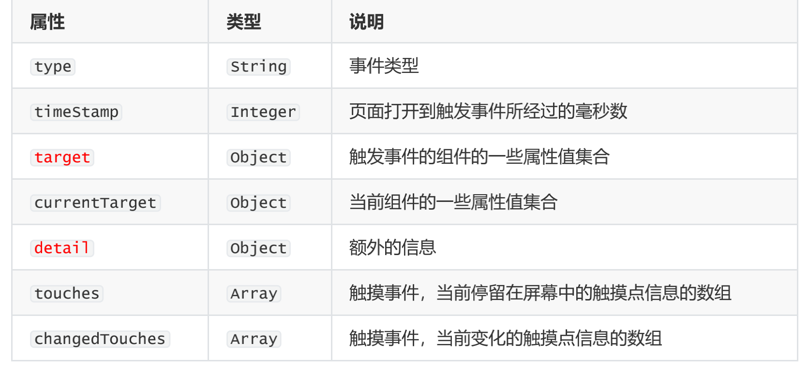
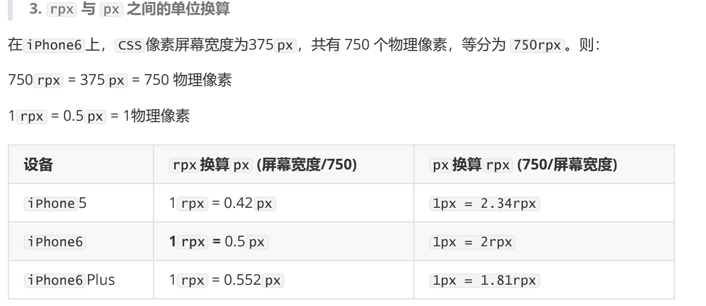
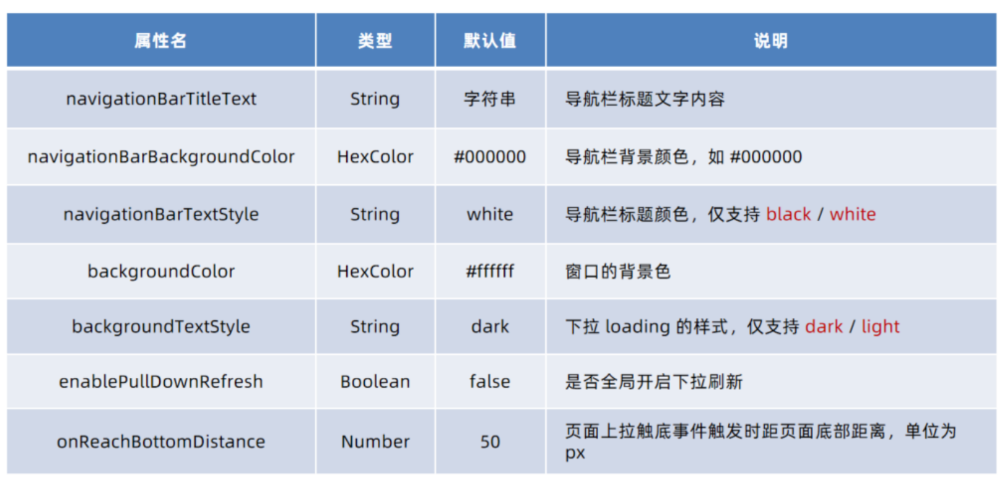
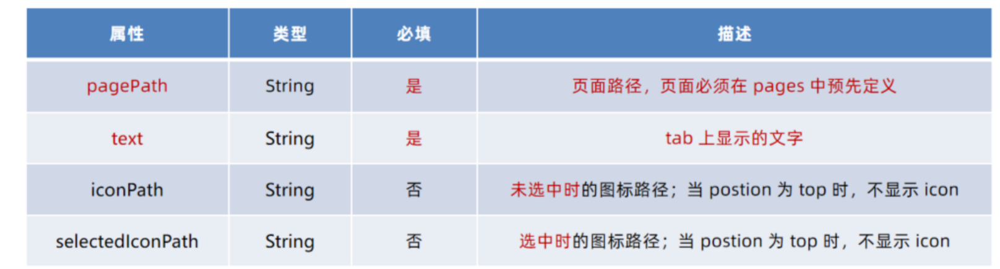
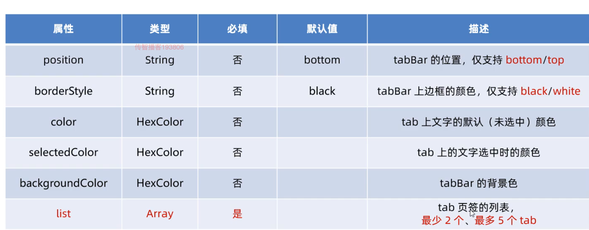

# WXML模版语法

## 数据绑定

1.在data中定义数据

2.在WXML中使用数据

```js
page({
  // 页面的初始数据
  data: {
    info: 'Hello World',
    // 如果是短横线的形式声明数据，则需要使用双引号包裹
    "user-name": 'XX'
  },
  // 生命周期函数--监听页面加载
  onLoad: function  (options) {
    
  }
})

// 把data中的数据绑定到页面中渲染，使用Mustache语法(双打括号)将变量包裹起来即可
<view>{{info}}</view>

#可以在data中进行运算
```

---

## 事件绑定

bindtap或bind:tap  => 手指触摸后马上离开，类似于HTML中的click事件

bindinput或bind:input => 文本框的输入事件

bindchange或bind:change => 状态改变时触发

---

当事件回调触发的时候，会收到一个事件对象event



```js
#target是触发该事件的源头组件，currentTarget则是当前事件所绑定的组件
```

---

## bindtap的使用

在小程序中，不存在HTML中的onclick鼠标点击事件，而是通过tap事件来影响用户的触摸行为

```js
//通过bindtap可以为组件绑定tap触摸事件
<button type="primary" bindtap="onHandleTap">按钮</button>

page({
  data: {
    
  },
  onHandletap: function (e) {
    console.log(e)
  }
})
```

---

## 访问数据

通过this.data.xxx的方式进行访问

---

## js中修改data中的数据

```js
// 通过this.setData(dataObject)方法，可以给页面data中的数据重新赋值
onAddhandle: function () {
  this.setData({
    count: this.data.count + 1 // 在原来的基础上 + 1
  })
}
```

---

## 事件传参

```js
<button bindtap="onBtnString" data-info="2">事件传参</button>

#info会作为名字存储在事件对象的target中的dataset中，2会被解析为值在事件处理函数中，通过event.target.dataset.info即可获取到值

onBtnString (e) {
  this.setData({
    count: this.data.count + e.target.dataset.info
  })
}
```

---

## bindinput的使用

```js
<view>
	<input class="ipt1" bindinput="inputValue" focus></input>
</view>

// 在js中定义处理函数
inputValue (e) {
  console.log(e)
  console.log(e.detail.value)
}
```

---

## 在小程序中实现数据双向绑定

```js
// 1.定义数据
data: {
  msg: '请输入'
}
//2.渲染机构
<view class='iptBox'>
  <input value="{{msg}}" bindinput="inputHandle" class='ipt2' type='checkbox'></input>
</view>
// 3.美化样式
略

//4.监听input事件
inputHandle (e) {
  this.setData({
    msg: e.detail.value
  })
}

```

---

## 条件渲染

```js
<view wx:if="{{type === 1}}">男</view>
<view wx:elif="{{type === 2}}">女</view>
<view wx:else>保密</view>
```

如果想要一次性控制多个组件的展示于隐藏，可以使用一个标签将多个组件包起来，并在标签上使用wx:if控制属性

```js
<block wx:if="{{true}}">
  <view>显示</view>
  <view>多个</view>
  <view>组件</view>
</block>
```

---

## hidden

```js
// 直接使用hidden="{{condition}}"也能控制元素的显示与隐藏
<view hidden="{{flag}}">条件为true时，隐藏元素</view>
```

---

## wx:if与hidden对比

### 1.运行方式不同：

wx:if以动态创建和移除元素的方式，控制元素的展示与隐藏

hidden以切换样式的方式，控制元素的展示与隐藏

### 2.使用建议：

频繁切换时，建议使用hidden

控制条件复杂时，建议使用wx:if搭配wx:elif,wx:else进行展示与隐藏的切换

---

## 列表渲染

```js
// 可以通过wx:for指定数组，进行循环渲染重复的组件结构
data: {
  arr1: [
    '苹果',
    '华为',
    '小米'
  ]
}

<view wx:for="{{arr1}}">
  索引是: {{index}} 当前项时：{{item}}
</view>
#默认情况下当前循环项的索引用index表示;当前循环项用item表示

// 手动指定索引和当前项的变量名
<view wx:for="{{arr1}}" wx:for-index="i" wx:for-item='ele'>
  索引是{{i}} 当前项时{{ele}}
</view>


// 也要使用wx:key来指定列表项唯一值
<view wx:for="{{arr1}}" wx:key="index">
  索引是: {{index}} 当前项时：{{item}}
</view>
#wx:key里面的值不用{{}}
```

---

## wxss模版样式

与css相比，wxss扩展的特性有：

### 1.rpx尺寸单位（在宽度上等分为750份，1份就是1rpx）



### 2.@import样式导入

```css
@import '/icon/icon.wxss'
```

---

## window

### 导航栏--顶部导航栏区域

### 背景区--默认不可见，下拉才显示

### 页面主体区--页面主体用来显示wxml中的布局



---

## tabBar

是移动端常见的页面效果，小程序中分为底部tabBar,顶部tabBar

注意：tabBar中只能配置最少2个，最多5个tab页签,当渲染顶部tabBar时，不显示icon只显示文本

---

## tabBar的六个组成部分

1.backgroundColor: tabBar的背景色

2.selectedIconPath: 选中时的图片路径

3.borderStyle: tabBar上边框的颜色

4.iconPath: 未选中时的图片路径

5.selectedColor: tab上的文字选中时的颜色

6.color:tab上文字的默认（未选中）颜色



```js
#在顶部显示时要配置position来让它在顶部显示
```



---

## 网络数据请求

该请求不能称之为ajax请求，但是可以成为网络请求

```js
onTapGet() {
  wx.request({
    // 必须是https协议
    url: 'https://',
    method: 'GET',
    data: {
      name: 'zs',
      age: 22
    },
    // 成功时触发
    success: (res) => {
      console.log(res)
    },
    complete: () => {
      //成功失败都会触发
    }
  })
}
```

