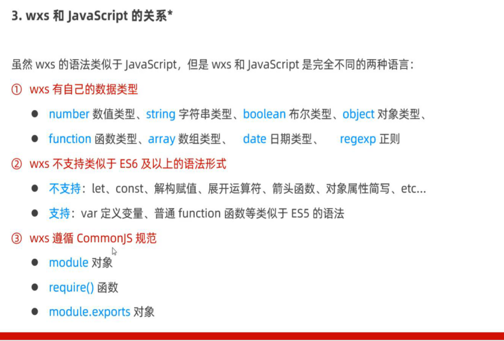

# 页面导航

## 声明式导航：

跳转到tabBar页面：

```js
//导航到tabBar的页面，在使用组件跳转到tabBar页面时，需要指定url属性和open-type属性，其中：
1.url表示要跳转的页面的地址，必须以/开头
2.open-type表示跳转的方式，必须为switchTab

<navigator url="/pages/message/message" open-type="switchTab">导航到消息页面</navigator>
```

跳转到非tabBar页面：

```js
1.url表示要跳转的页面地址，必须以/开头
2.open-type表示跳转的方式，必须为navigate,或者省略

<navigator url="/pages/info/info" open-type="navigate">导航到info页面</navigator>
```

后退导航：

```js
1.open-type表示跳转的方式，必须为navigateBack
2.delta的值必须是数字，表示要后退的层级，如果只后退一个页面可以省略

<navigator open-type="navigateBack" delta="1">后退</navigator>
```

---

## 编程式导航

导航到tabBar页面：

```js
// 调用wx.switchTab(Object object)方法，可以跳转到tabBar页面

<button bindtap="gotoMessage">跳转到消息页面</button>

gotoMessage() {
  wx.switchTab({
    url: '/pages/message/message'
  })
}
```

导航到非tabBar页面:

```js
// 调用wx.navigateTo(Object object)方法
<button bindtap="gotoInfo">跳转到info页面</button>

gotoMessage() {
  wx.navigateTo({
    url: '/pages/info/info'
  })
}
```

后退导航：

```js
// 调用wx.navigateBack(Object object)
<button bindtap="goBack">后退</button>

goBack() {
  wx.navigateBack({
    delta: 1
  })
}
```

---

## 导航传参

### 声明式导航传参

```js
1.参数与路径之间用?分隔
2.参数键与参数值用=相连
3.用&分开

<navigator url="/pages/info/info?name=zs&age=20">跳转到info页面</navigator>
```

---

### 编程式导航传参

```js
//调用wx.navigateTo(Object object)方法跳转页面时，也可以携带参数

<button bindtap="gotoInfo2">跳转到info页面</button>

gotoInfo2 () {
  wx.navigateTo({
    url: '/pages/info/info?name=ls&gender=男'
  })
}
```

### 在onLoad中可以获取传递的参数

```js
onLoad: function (options) {
  console.log(options)
  this.setData({
    query: options
  })
}

// 一般在data里定义个query空对象把传递的参数存起来以方便其他函数中访问
```

---

## 页面事件

### 下拉刷新事件

#### 全局下拉刷新

```js
在app.json文件中配置	 "enablePullDownRefresh": true
```

### 局部下拉刷新

```js
在相应页面的json文件中配置 "enablePullDownRefresh": true
```

---

### 配置样式

```js
"backgroundColor": "#efefef",// 配置背景颜色
"backgroundTextStyle": "dark" // 配置小圆点的颜色
```

---

### 监听页面的下拉刷新事件

```js
// 通过onPulldownRefresh()可以监听下拉刷新事件
onPulldownRefresh: function () {
  console.log('触发了下拉刷新事件')
}
```

---

### 关闭页面的下拉刷新事件

```js
// wx.stopPullDownRefresh()可以停止当前页面的下拉刷新事件
```

---

### 上拉触底

#### 监听页面的上拉触底事件

```js
// 通过onReaChBottom() 即可监听上拉触底事件
onReachBottom: function () {
    
  },
// 可以通过onReaChBottomDistance来配置触发这个事件的距离
```

---

## 生命周期

### 生命周期的分类

#### 应用生命周期

特指小程序从启动 => 运行 => 销毁的过程

#### 页面生命周期

特指小程序中，每个页面的加载 => 渲染 => 销毁的过程

---

## 生命周期函数

是由小程序框架提供的内置函数，会伴随生命周期，自动按次序执行

生命周期强调的是时间段，生命周期函数强调的是时间点

---

## 生命周期函数的分类

### 应用的生命周期函数

```js
// 在小程序初始化完成功自动触发，只会触发一次
onLaunch: function (options) {}

// 小程序启动，或从后台进入前台显示时触发
onShow: function(options) {}

// 小程序从前台进入后台时触发
onHide: function(){}
```

### 页面的生命周期函数

```js
// 监听页面的加载，一个页面只调用一次
onLoad: function(options) {}

// 页面显示或从后台进入前台触发
onShow: function() {}

// 监听页面初次渲染完成，一个页面只调用一次
onReady: function() {}

// 监听页面隐藏
onHide: function() {}

// 监听页面卸载，一个函数只调用一次
onUnload: function() {}
```

---

## wxs脚本



---

## wxs与js的不同

1.不能作为组件的事件回调，要配合{{}}使用

2.隔离性：wxs不能调用js中的方法。也不能调用小程序的API

3.在ios设备上，小程序内的wxs比js块2-20倍，在安卓上无差异

4.是两种不同的语言

---

## wxs用法

```js
<view>{{m1.toUpper(username)}}</view>

<wxs module="m1">
  module.exports.toUpper = function(str) {
    return str.toUpperCase()
  }
</wxs>

// 外链式
<view>{{m2.toLower(country)}}</view>

<wxs src="../../utils/tools.wxs" module="m2"></wxs>
#必须要写module来指定
```

---


