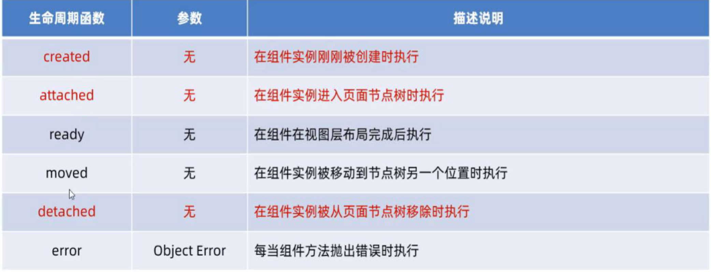
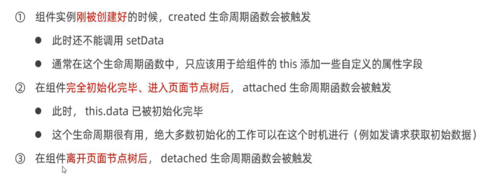
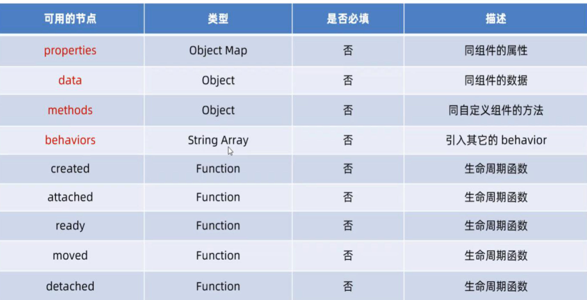

# 小程序基础加强

## 组件的创建与引用

### 局部引用

在页面的.json配置中引用组件叫局部引用

```js
// 引用组件
"usingComponents": {
  "my-test1": "/components/test/test"
}

// 以名字为标签引用
<my-test1></my-test1>
```

### 全局引用

在app.json配置中引用组件叫全局引用，代码如上

---

## 组件和页面的区别

1.组件的.json中需要声明"component":true属性

2.组件的.js中调用的是Component()函数

3.组件的事件处理函数需要定义到methods节点中

---

## 样式隔离

默认情况下，自定义组件的样式只对当前组件生效，不会影响到组件之外的UI结构

```js
#注意：1.在全局样式表里声明的样式对组件来说是无效的。2.只有class选择器才会受样式隔离的影响，其他选择器不会受影响，因此在组件和引用组件的页面中尽量使用class选择器
```

---

## 修改组件的样式隔离选项

```js
// .js文件
Component({
  options: {
    styleIsolation: 'isolated' // 默认，启用了样式隔离，apply-shared表示页面的wxss样式会影响到自定义组件，但自定义组件的样式不会影响到页面，shared表示都会互相影响
  }
})
```

---

## 自定义组件--数据、方法和属性

### data数据

用于组件的数据要定义到data节点中

### methods方法

在小程序组件中，事件处理函数和自定义方法需要定义到methods节点中

自定义方法以_开头以区分

### properties属性

父向子传值

```js
<my-test1 max="10"></my-test1>

Component({
  properties: {
    max: { //完成定义属性的方式
      type: Number,// 属性的数据类型
      value: 10 // 属性默认值
    },
    max: Number // 简化定义属性的方式，不需要指定默认值时，可以使用此方式
  }
})
```

### data和properties的区别

在小程序的组件中，properties属性和data数据的用法相同。他们都是可读可写的，只不过data更倾向于存储组件的私有数据，properties更倾向于存储外界传递到组件中的数据

### 使用setData修改properties的值

```js
<view>max属性的值为: {{max}}</view>

Component({
  properties: { max: Number}, // 定义属性
  methods: {
    addCount: {
      this.setData({
      max: this.properties.max + 1
    })
    }
  }
})
```

---

## 数据监听

```js
Component({
    observers: {
    '字段A, 字段B': function(字段A的新值，字段B的新值) {
      // do something 
    }
  }
})

// 监听对象中单个或多个对象
Components({ // observers: 观察者 
  observers: { '对象.属性A， 对象.属性B': function(属性A的新值， 属性B的新值) { 
    // 触发此侦听器的 3 种情况： 
    // 【为属性A赋值】：使用setData 设置this.data.对象.属性A 时触发 
    // 【为属性B赋值】：使用setData 设置this.data.对象.属性B 时触发 
    // 【为对象赋值】：使用setData 设置this.data.对象 时触发 
  } }) 
  
#为了方便可以使用通配符**来监听对象中所有数据的变化
observers: { '_rgb.**': function (obj) { 
  this.setData({ 
    fullColor:`${obj.r}, ${obj.g}, ${obj.b}` 
  	}) 
	}
} 
```

---

## 纯数据字段

不用与页面渲染的data字段，有助于提升页面更新的性能

```js
// 在Component构造器的options节点中，指定pureDataPattern为一个正则表达式
Component({
  options: {
    pureDataPattern: /^_/
  },
  data: {
    a: true, // 普通字段
    _b: ture // 纯数据字段
  }
})
```

---

## 组件的生命周期函数





### lifetimes节点

```js
// 新的定义方式,在此节点定义
Component({
  lifetimes: {
    created () {
      console.log('!')
    },
    attached () {
      console.log('?')
    }
  }
})
```

---

## 组件所在页面的生命周期

自定义组件的行为依赖与页面状态的变化，此时就需要用到组件所在页面的生命周期

show => 组件所在页面被展示时执行

hide => 组件所在页面被隐藏时执行

resize => Object Size => 组件所在页面尺寸变化时执行

```js
// 与data节点平级
pageLifetimes: {
  show() {},
  hide() {},
  resize(size) {}
}
```

---

## 自定义组件--插槽

可以提供一个<slot>节点，用于承载组件使用者提供的wxml结构

### 单个插槽

在小程序中，默认每个自定义组件中只允许使用一个<slot>进行占位，这种个数上的限制叫做单个插槽

```js
// 自定义组件
<view>
  <view>这里组件的内部结构</view>
  <slot></slot>
</view>

// 页面组件
<my-test4>
  <view>这是通过插槽填充的内容</view>
</my-test4>

```


### 多个插槽

```js
// 自定义组件
Component({
  options: {
    multipleSlots: true // 启用多个插槽支持
  }
})

// 定义多个插槽
<view>
  <slot name="before"></slot>
  <view>这里组件的内部结构</view>
  <slot name="after"></slot>
</view>

// 页面组件
<my-test4>
  <view slot="before">这是通过插槽填充的before内容</view>
  <view slot="after">这是通过插槽填充的after内容</view>
</my-test4>
```

---

## 父子组件之间的通信（三种）

### 属性绑定

用于父组件向子组件的置顶属性设置数据，仅能设置JSON兼容的数据

### 事件绑定

用于子组件向父组件传递数据，可以传递任意数据

```js
// 1.在父组件的js中，定义一个函数，这个函数即将通过自定义事件的形式，传递给子组件
syncCount() {
  console.log(1)
}
// 2.在父组件的wxml中，通过自定义事件的形式，将步骤1中定义的函数引用，传递给子组件
<my-test3 count="{{count}}" bindsync="syncCount"></my-test3>
// 3.在子组件的js中，通过调用this.triggerEvent('自定义事件名称', {参数对象}),将数据发送给父组件
this.triggerEvent('sync', {value: this.properties.count})
// 4.在父组件中通过e.detail获取子组件窜地过来的值
syncCount(e) {
  this.setData({
    count: e.detail.value
  })
}
```

### 获取组件实例

父组件可以通过this.selectComponent()获取子组件实例对象

这样就可以直接访问子组件的任意数据和方法,需要传入一个选择器

```js
// 页面组件
<my-test3 count="{{count}}" bindsync="syncCount" class="customA" id="cA"></my-test3>
<button bindtap="getChild">获取子组件的实例对象</button>

getChild() {
    const child = this.selectComponent('.customA') 
      console.log(child)
      // child.setData({
      //   count: child.properties.count  + 1
      // }) 只改变子组件的值
      child.addCount() // 触发原型对象上的方法更改子组件和父组件的值
  },

```

---

## behaviors代码共享

```js
// 1.新建behaviors文件夹，新建behaviors.js文件
module.exports = Behavior({
  data: {
    username: 'zs'// 共享的变量
  },
  properties: {}, 
  methods: {} // 共享的方法
})

// 2.引入到要使用的组件
const myBehavior = require('../../behaviors/my-behavior')
Component({
  behaviors: [myBehavior] // 就可以在wxml中用{{}}访问到behaviors里的变量或者方法了
})
```

---

## behaviors中可用的节点



---

## behaviors同名字段的覆盖和组合规则

1.同名的数据字段

2.同名的属性或方法

3.同名的生命周期函数

详情：https://developers.weixin.qq.com/miniprogram/dev/framework/custom-component/behaviors.html